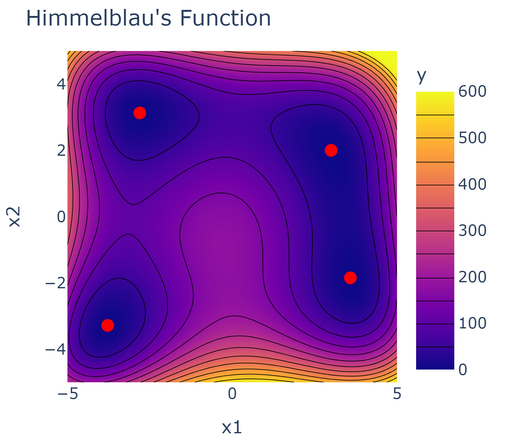
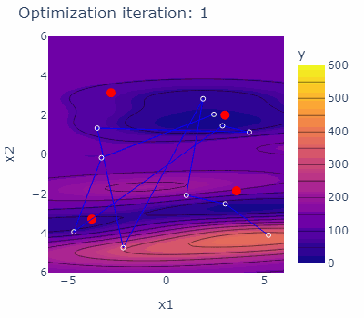

<a href=https://experimental-design.github.io/bofire/>
  
</a>

# **BoFire** - **B**ayesian **O**ptimization **F**ramework **I**ntended for **R**eal **E**xperiments


BoFire is a powerful Python package that serves as a comprehensive framework for experimental design. BoFire is designed to empower researchers, data scientists, engineers, and enthusiasts who are venturing into the world of Design of Experiments (DoE) and Bayesian optimization (BO) techniques.


## Quickstart

Let us consider a test function for single-objective optimization - the [Himmelblau's function](https://en.wikipedia.org/wiki/Himmelblau%27s_function). The Himmelblau's function is a multi-modal function with four identical local minima used to test the performance of optimization algorithms. The optimization domain of the Himmelblau's function is illustrated below together with the four minima marked red.

<div style="text-align: center;">
    
</div>

### Defining the optimization output

Let's consider the single continuous output variable of the Himmelblau's function with the objective to minimize it. In BoFire's terminology, we create a `MinimizeObjective` object indicating the optimization objective of a `Continuous Output`feature with the key *y*.

```Python
from bofire.data_models.features.api import ContinuousOutput
from bofire.data_models.objectives.api import MinimizeObjective

objective = MinimizeObjective()
output_feature = ContinuousOutput(key="y", objective=objective)
```

For more details on `Output` features and `Objective` objects, see the respective sections in our [docs](https://experimental-design.github.io/bofire/install/).


### Defining the optimization inputs

Let's call the two continuous input variables of the Himmelblau's function *x1* and *x2*. In BoFire's terminology, we create two `ContinuousInput` features with corresponding keys and boundaries.

```Python
from bofire.data_models.features.api import ContinuousOutput

input_feature_1 = ContinuousInput(key="x1", bounds=(-6, 6))
input_feature_2 = ContinuousInput(key="x2", bounds=(-6, 6))
```

For more details on `Input` features, see the respective sections in our [docs](https://experimental-design.github.io/bofire/install/).


### Defining the optimization domain

In BoFire's teminology, `Domain` objects fully describe the search space of the optimization problem. Here, it binds `Input` and `Output` features. Optionally, we can add `Constraint` objects to the domain to specify allowed relationships between our parameters. For more details, see the respective sections in our [docs](https://experimental-design.github.io/bofire/install/).

```Python
from bofire.data_models.domain.api import Domain, Inputs, Outputs

domain = Domain(
    inputs=Inputs(features=[input_feature_1, input_feature_2]),
    outputs=Outputs(features=[output_feature]),
)
```

### Draw and run "experiments"

Let's define the Himmelblau's function to evaluate points in the domain space.

```Python
def himmelblau(x1, x2):
    return ((x1**2 + x2 - 11)**2+(x1 + x2**2 -7)**2)
```

To initialize an iterative Bayesian optimization loop, let's first randomly draw 10 samples from the domain.

```Python
samples = domain.inputs.sample(10, seed=13)
print(samples)
```
```plaintext
>          x_1       x_2
>  0  1.271053  1.649396
>  1 -5.012360 -1.907210
>  2 -4.541719  5.609014
>  3  ...       ...
```

Let's "run" the randomly drawn experiments using the `himmelblau` function.

```Python
samples["y"] = samples.apply(lambda row: himmelblau(row["x_1"], row["x_2"]), axis=1)
print(y)
```

```plaintext
        x_1       x_2           y
>  0  1.271053  1.649396   68.881387
>  1 -5.012360 -1.907210  219.383137
>  2 -4.541719  5.609014  628.921615
>  3 ...        ...       ...
```

### Defining an optimization strategy

Let's specify the strategy how the optimization should be conducted. Here, we define a single-objective Bayesian optimization strategy and pass it the `Domain` object as well as the acquisition function optimizing for logarithmic expected improvement `qLogEI`. First, we create the serializable data model `SoboStrategy` which we then map to our functional model.

```Python
from bofire.data_models.acquisition_functions.api import qLogEI
from bofire.data_models.strategies.api import SoboStrategy
import bofire.strategies.api as strategies

sobo_strategy_data_model = SoboStrategy(domain=domain, acquisition_function=qLogEI(), seed=19)

sobo_strategy = strategies.map(sobo_strategy_data_model)
```

### Run the optimization loop

```Python
sobo_strategy.tell(experiments=samples)

# optimize
for i in range(30):
    new_samples = sobo_strategy.ask(candidate_count=1)
    new_samples["y"] = new_samples.apply(lambda row: himmelblau(row["x_1"], row["x_2"]), axis=1)
    samples = pd.concat([samples, new_samples], join="inner")

    sobo_strategy.tell(experiments=samples)
```
<div style="text-align: center;">
    
</div>

