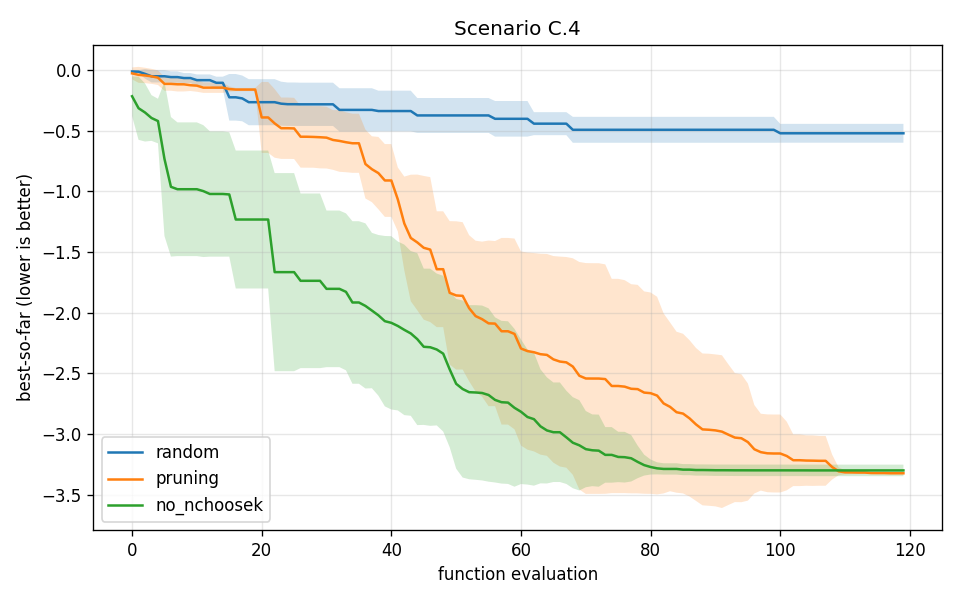

# Greedy Pruning for NChooseK Constraints

This document describes the greedy pruning post-processing step used to enforce
NChooseK (cardinality) constraints during acquisition function optimization. The
algorithm is a direct adaptation of the BONSAI procedure
(Daulton et al., *Bayesian Optimization with Natural Simplicity and
Interpretability*, arXiv:2602.07144) to BoFire's setting of mixed continuous /
semi-continuous features and (optionally) overlapping linear constraints.

## Motivation

NChooseK constraints are non-convex: they require that, out of a set of
candidate features, at most `max_count` (and at least `min_count`) take a
strictly positive value. Encoding this directly in the acquisition function
optimizer turns the problem into a mixed-integer program, which is expensive,
brittle, and forces the optimizer onto disconnected feasible regions.

The BONSAI insight is that we don't need to encode the cardinality constraint
inside the optimizer at all. Instead:

1. Optimize the acquisition function on a *convex relaxation* of the feasible
   set, ignoring the cardinality constraint.
2. Post-process the resulting candidate by greedily pushing features off the
   active set until the cardinality constraint is satisfied, choosing at each
   step the feature whose removal costs the least acquisition value.

This is the same pattern the original BONSAI paper applies to "deviations from a
default configuration", with the default value here taken to be zero.

## Setting

Each feature `x_j` has

- a lower bound `lb_j ≥ 0` and upper bound `ub_j > lb_j`,
- optionally an `allow_zero` flag, indicating that the value `0` is also
  feasible even when `lb_j > 0` (i.e. the feasible set per feature is the
  disconnected union `{0} ∪ [lb_j, ub_j]`).

A feature is called **semi-continuous** when `allow_zero` is true and
`lb_j > 0`. Note that a single semi-continuous feature is structurally a
one-feature NChooseK constraint with `min_count = 0`, `max_count = 1`,
`none_also_valid = True`. The algorithm treats both cases uniformly.

The feasible set may also include linear equality and inequality constraints
that *overlap* the NChooseK feature set (e.g. a mixture constraint
`Σ x_j = 1` over the same features that participate in the NChooseK).
Nonlinear or interpoint constraints overlapping the NChooseK feature set are
**not supported** by this algorithm — they are blocked at the domain level and
fall back to the standard nonlinear-constrained acquisition optimization.

## Algorithm

### Step 0 — Acquisition function optimization on the convex relaxation

The acquisition function is optimized over the box `[0, ub_j]` for every
feature, with the linear constraints kept active. The semi-continuity gap
`(0, lb_j)` and the NChooseK cardinality constraint are *both* relaxed away at
this stage. The optimizer therefore sees a convex (or at least well-behaved)
feasible set and can use gradients freely.

The result is a dense candidate `x*` in which every feature falls into one of
three states:

- **zero:** `x*_j = 0`. No further decision needed.
- **fractional:** `x*_j ∈ (0, lb_j)`. Violates semi-continuity. Must be either
  zeroed or snapped into `[lb_j, ub_j]`.
- **cleanly active:** `x*_j ∈ [lb_j, ub_j]`. No semi-continuity issue, but
  may still need to be zeroed to satisfy NChooseK.

Let `a` denote the active count `|{j : x*_j > 0}|`.

### Step 1 — Greedy pruning loop

The loop maintains a current candidate that starts at `x*` and, at each
iteration, commits one *action* that moves a single feature into a terminal
state (`0` or `[lb_j, ub_j]`). Three kinds of actions are considered.

**Zero action `zero(j)`** — pin `x_j = 0` and re-establish feasibility of the
remaining features against the linear constraints. If a feature `j` is currently
active (fractional or cleanly active), this is always available. Committing
`zero(j)` decrements the active count by one.

**Active action `active(j)`** — only available for currently fractional
features. Set the bounds of `j` to `[lb_j, ub_j]` and re-establish feasibility.
Committing `active(j)` resolves the semi-continuity violation for `j` without
changing the active count.

**Activate action `activate(j)`** — only available for currently zero
features, and only when some NChooseK constraint has `a_c < min_count_c` (an
"under-budget" violation). Snap `x_j` into a positive band — `[lb_j, ub_j]`
for semi-continuous features, `[ε, ub_j]` otherwise — and re-establish
linear feasibility. Committing `activate(j)` increments the active count by
one. See [The activate action](#the-activate-action--handling-min_count--0)
below for eligibility and the `none_also_valid` interaction.

For each candidate action, a per-action *variant* candidate is constructed (see
hyperparameters below). The acquisition function is evaluated at each variant.
The action with the **highest acquisition value** (equivalently, the smallest
acquisition reduction relative to the dense AF value) is committed.

### Step 2 — Termination and the min_count guard

The loop terminates when *both* of the following hold:

- no feature is fractional, and
- `min_count ≤ a ≤ max_count`.

The upper bound `a ≤ max_count` is enforced by exhaustion: once all fractional
features have been resolved, the action set contains only zero variants, and
each commit decrements `a` by one until the bound is met.

The lower bound `a ≥ min_count` is **not** automatically respected by the
greedy rule, because the rule is budget-blind: it always picks the action with
smallest acquisition loss, even if that action would drop `a` below `min_count`.
This is what the **min_count guard** prevents.

The guard is a filter applied to the action set at every iteration: a
`zero(j)` action is removed from the set whenever committing it would bring
`a − 1 < min_count`. (When `none_also_valid = True` the guard also tolerates
`a = 0` as a special case.) Active actions are never filtered. If the filtered
action set is empty before the constraint is met — for example, because every
remaining variant is QP-infeasible — the algorithm raises rather than returning
an infeasible candidate.

### Properties

- Each iteration commits exactly one action, and each fractional feature can
  appear in at most one active action. The loop therefore terminates in at most
  `n` iterations, where `n` is the number of features in the NChooseK group.
- Linear feasibility is enforced at every step by construction: each variant is
  built with `x_j` either fixed at zero or constrained to `[lb_j, ub_j]`, and
  projected onto the linear constraint set. Variants whose projection is
  infeasible are dropped from the action set for that iteration.
- The acquisition value is monotonically traded for feasibility in the BONSAI
  sense: at every step, the smallest available acquisition loss is incurred.
- The procedure is deterministic given a fixed acquisition function and a
  fixed dense candidate `x*`.

## Multiple NChooseK constraints

The algorithm extends to domains with several NChooseK constraints — possibly
on disjoint feature sets, possibly overlapping — without changing its
selection rule. Three book-keeping changes are needed.

### Per-constraint active counts

Instead of a single active count `a`, the loop tracks an active count `a_c`
for every NChooseK constraint `c`. A commit on a feature `j` updates `a_c`
for every constraint `c` whose feature set contains `j`. Disjoint
constraints update independently; overlapping constraints update in lock-step
on shared features.

### Termination is a conjunction over all constraints

The loop terminates when *no* feature is fractional and *every* NChooseK
constraint is satisfied:

```
fractional == ∅   AND   ∀ c :  min_count_c ≤ a_c ≤ max_count_c
```

If even one constraint is still violated, the loop continues.

### The min_count guard becomes per-constraint

A `zero(j)` action is filtered out of the action set whenever it would push
`a_c` below `min_count_c` for any constraint `c` that contains `j` (with the
usual `none_also_valid` exception that allows `a_c = 0`). Active actions are
never filtered. As before, an empty filtered action set before all
`max_count_c` are satisfied indicates a mutually infeasible configuration:
the algorithm raises rather than returning an infeasible candidate.

### The activate action — handling `min_count > 0`

The zero/active action pair is sufficient when the dense candidate already has
`a ≥ min_count` for every constraint: the loop only ever needs to *reduce*
the active count to land inside `[min_count, max_count]`. When the AF
maximizer places mass on fewer features than required by some constraint
(`a_c < min_count_c`), neither action can resolve the violation:

- `zero(j)` decreases `a_c`, away from feasibility, and is blocked by the
  min_count guard.
- `active(j)` only resolves *fractional* features; it never moves a
  currently-zero feature into the active set.

A third action category, `activate(j)`, fills this gap. It targets a
currently-zero feature `j` and proposes to move it into the active region:

- if `j` is semi-continuous, into its natural band `[lb_j, ub_j]`;
- otherwise, into `[ε, ub_j]` for a small ε just above the classification
  tolerance (so the variant is unambiguously classified as active).

Eligibility is the dual of the zero-action eligibility rule: `j` is a valid
target iff it is currently zero *and* participates in at least one
**min-count-violated** constraint (`a_c < min_count_c` for some `c ∋ j`,
honouring `none_also_valid`). A symmetric **max_count guard** filters out
activations that would push some `a_c` above `max_count_c`. With these in
place the loop's exit condition extends naturally to

```
fractional == ∅   AND   ∀ c :  min_count_c ≤ a_c ≤ max_count_c
```

The greedy selection rule is unchanged: every iteration collects zero,
active, and activate variants into a single action set, evaluates the AF at
each variant, and commits the action with the smallest AF reduction.

#### `none_also_valid = True`

When a constraint allows `a_c = 0` (the empty formulation is valid) and the
dense candidate enters the loop with `0 < a_c < min_count_c`, two
trajectories could in principle satisfy the constraint: walk *up* to
`a_c = min_count_c` via activate actions, or walk *down* to `a_c = 0` via
zero actions. The greedy commits one action per iteration with no
multi-step lookahead, so any intermediate state with `0 < a_c < min_count_c`
is itself infeasible and the per-step zero-guard blocks every zero action
along the walk-down trajectory. The loop therefore only ever takes the
walk-up route.

This is a deliberate design choice: walking down through infeasible
intermediate states is unsafe in the presence of *other* NChooseK
constraints with `none_also_valid = False`, which would force activation
before the count reached zero — leaving the algorithm to commit zeros that
it later has to undo. The reachable `a_c = 0` outcome is the case where the
AF maximizer placed the candidate at `a_c = 0` to begin with; the loop
accepts that as feasible immediately. Users who want the algorithm to
*prefer* an empty formulation should encode that preference in the AF
itself (e.g. via a sparsity prior), not in the pruning rule.

#### Iteration cap

Activate makes the action set non-monotone in principle: a feature can flip
zero → active → zero across iterations if AF preferences shift between
commits. To bound runtime against pathological non-determinism, the loop
caps per-candidate iterations at `2 × n_features` and raises
`PruningInfeasibleError` if exceeded. In practice the AF-driven greedy
converges in `≤ d` iterations because the AF reduction shrinks each step;
the cap is a safety net, not a regular path.

### A useful efficiency restriction

When NChooseK constraints overlap with cleanly-active features, it is
worthwhile to further restrict the zero-action set to features that
participate in at least one *currently violated* constraint
(`a_c > max_count_c` for some `c ∋ j`). Zeroing a feature outside every
violated constraint costs acquisition value without contributing to
feasibility, and the greedy rule would never pick such an action anyway —
making the restriction a free pruning of the action set rather than a change
in behaviour.

### Termination bound

Each commit either resolves a fractional feature (one active or zero
commit per fractional feature) or zeros a cleanly-active feature whose
removal closes a `max_count_c` gap. The total number of iterations is
therefore bounded by

```
|fractional| + Σ_c  max(0, a_c − max_count_c)
```

evaluated at the dense relaxation candidate.

### Disjoint vs. overlapping feature sets

Disjoint NChooseK constraints are essentially independent: the loop iterates
over the union of their feature sets, but no commit on one constraint's
features ever affects another constraint's `a_c`. The interesting case is
overlapping constraints, where a single zero commit can simultaneously
reduce the violation of several constraints (the favourable interaction)
or simultaneously block several min_count guards (the failure mode that
forces the algorithm to raise).

## Hyperparameters

The algorithm exposes two knobs that trade computational cost against the
fidelity of the per-action acquisition value estimate.

### `per_step_local_reopt: bool`

Controls how each action's variant candidate is constructed.

- **`False` (project only).** When linear constraints overlap the NChooseK
  feature set, the dense candidate is QP-projected onto the linear feasible set
  with the per-action bound (`x_j = 0` for `zero`, `x_j ∈ [lb_j, ub_j]` for
  `active`) applied. The acquisition value is evaluated directly at this
  projected point. When no linear overlap exists, the projection collapses to
  simple coordinate replacement (zeroing `x_j` or clamping it into `[lb_j,
  ub_j]`).
- **`True` (project then locally reoptimize).** After QP projection, the
  acquisition function is locally re-optimized starting from the projection,
  with the per-action bound retained. The acquisition value of each action then
  reflects the *best achievable* AF value under that bound, rather than the
  acquisition at an arbitrary feasible warm-start.

Project-only is cheaper by a factor equal to the per-action local solver cost
and is usually good enough when the acquisition surface is smooth on the scale
of the linear-projection displacement. Local reoptimization is more accurate
and is recommended when the acquisition is sharp near the boundary of `lb_j`
(e.g. peaks immediately above `lb_j`).

### `final_local_reopt: bool`

Controls whether the final pruned candidate is locally reoptimized as a
clean-up step.

- **`False`.** The candidate returned by the greedy loop is returned as-is.
  Its components are guaranteed to lie in `{0} ∪ [lb_j, ub_j]` and to satisfy
  all linear and NChooseK constraints by construction.
- **`True`.** A single local acquisition optimization is run with the active
  set frozen — features that the loop committed to zero stay at zero, and
  features that the loop committed to active remain in `[lb_j, ub_j]`. This
  cleans up small drifts introduced by the per-step QP projections and lets the
  optimizer settle into the local AF maximum within the now-feasible region.

The cost of `final_local_reopt = True` is one extra local solve, independent of
the size of the NChooseK group, and it is usually worth enabling unless the
acquisition optimizer call is expensive.

The two knobs are independent. A useful default combination is
`per_step_local_reopt = False, final_local_reopt = True`: cheap per-action
estimates drive the greedy decisions, and a single end-of-pipeline solve
absorbs the accumulated rounding from the QP projections.

## Worked example

Consider a domain with four features `x1, x2, x3, x4`, each with bounds
`(0, 1)`, `allow_zero = True` and `lb = 0.2`, subject to

- a mixture equality `x1 + x2 + x3 + x4 = 1`,
- an NChooseK constraint on `{x1, x2, x3, x4}` with `min_count = 1`,
  `max_count = 2`, `none_also_valid = False`.

### Step 0

Acquisition function maximization on the convex relaxation
`x_j ∈ [0, 1], Σ x_j = 1` returns

```
x* = (0.60, 0.30, 0.05, 0.05)
```

State of features:

| feature | value | state              |
|---------|-------|--------------------|
| x1      | 0.60  | cleanly active     |
| x2      | 0.30  | cleanly active     |
| x3      | 0.05  | fractional         |
| x4      | 0.05  | fractional         |

Active count `a = 4`, exceeding `max_count = 2`.

### Iteration 1

The exit condition fails: `fractional = {x3, x4}` is non-empty and `a = 4`
exceeds the budget.

The action set has zero variants for every active feature and active variants
for the fractional ones. After QP projection (and, optionally, local
reoptimization) onto the mixture constraint, illustrative acquisition values
are:

| action      | candidate after projection       | AF value |
|-------------|----------------------------------|----------|
| zero(x1)    | (0.00, 0.60, 0.20, 0.20)         | 0.71     |
| zero(x2)    | (0.70, 0.00, 0.20, 0.10)         | 0.78     |
| zero(x3)    | (0.62, 0.32, 0.00, 0.06)         | 0.84     |
| zero(x4)    | (0.62, 0.32, 0.06, 0.00)         | 0.84     |
| active(x3)  | (0.55, 0.25, 0.20, 0.00)         | 0.82     |
| active(x4)  | (0.55, 0.25, 0.00, 0.20)         | 0.82     |

The min_count guard would block any action that brings `a` below 1; here every
zero action leaves `a ≥ 3` so none are filtered.

The greedy rule picks the action with the highest acquisition value. Both
`zero(x3)` and `zero(x4)` are tied at `0.84`. Break the tie deterministically
(say, in feature order) and commit `zero(x3)`.

```
candidate ← (0.62, 0.32, 0.00, 0.06)        a = 3,   fractional = {x4}
```

Notice that `zero(x3)` resolved both the semi-continuity violation on `x3`
*and* freed one NChooseK slot in a single move — the BONSAI rule arbitrates
between the two purposes naturally.

### Iteration 2

The exit condition still fails: `fractional = {x4}` and `a = 3 > 2`.

Re-evaluate the action set against the new candidate. `x3` is now permanently
zero and is removed from consideration.

| action      | candidate after projection       | AF value |
|-------------|----------------------------------|----------|
| zero(x1)    | (0.00, 0.70, 0.00, 0.30)         | 0.69     |
| zero(x2)    | (0.80, 0.00, 0.00, 0.20)         | 0.75     |
| zero(x4)    | (0.66, 0.34, 0.00, 0.00)         | 0.83     |
| active(x4)  | (0.55, 0.25, 0.00, 0.20)         | 0.82     |

The greedy rule picks `zero(x4)` at `0.83` and commits.

```
candidate ← (0.66, 0.34, 0.00, 0.00)        a = 2,   fractional = ∅
```

### Iteration 3

The exit condition holds: no feature is fractional and `a = 2` lies in
`[min_count, max_count] = [1, 2]`.

If `final_local_reopt` is enabled, a single local acquisition optimization is
run with `x3 = x4 = 0` fixed and `x1, x2 ∈ [0.2, 1]`. This may slightly refine
the values of `x1` and `x2` while preserving every constraint. Otherwise the
candidate is returned as is:

```
final candidate = (0.66, 0.34, 0.00, 0.00)
```

The candidate satisfies the mixture equality (`Σ = 1.0`), the per-feature
semi-continuity (`x ∈ {0} ∪ [0.2, 1]` for every coordinate), and the NChooseK
constraint (`a = 2 ≤ max_count = 2` and `a = 2 ≥ min_count = 1`).

## Comparison to the published BONSAI algorithm

The algorithm above differs from the published BONSAI procedure in two
respects:

1. **Default value.** BONSAI prunes deviations from an arbitrary user-supplied
   default configuration; here, the default is fixed at zero, which is the
   natural reference value for cardinality constraints.
2. **Termination.** BONSAI terminates when the relative acquisition loss
   exceeds a user-specified threshold `ρ`. The variant described here
   terminates when the NChooseK and semi-continuity constraints are exactly
   satisfied, with no AF-loss budget. This makes the procedure feasibility-first
   rather than acquisition-loss-first, which is the appropriate trade-off when
   the cardinality constraint is a hard requirement of the experimental design.
   The min_count guard is the corresponding feasibility-first analogue of
   BONSAI's "do not prune below the floor" rule.

The greedy selection rule itself — at each step, prefer the action with
smallest acquisition reduction — is unchanged.

## Empirical behaviour

The algorithm has been exercised on a small benchmark suite around the
Hartmann-6 test function. One scenario is included here to illustrate the typical
behaviour with overlapping NChooseK constraints.

### Scenario: tight overlapping NChooseK with reachable optimum

- Hartmann-6 + 16 spurious features (22 inputs total).
- NCK_1 over `{x_1..x_4, x_spurious_0..13}` with `max_count = 4`.
- NCK_2 over `{x_3..x_6, x_spurious_2..15}` with `max_count = 4`.
- Overlap zone covers `{x_3, x_4}` plus 12 spurious features.
- Both NChooseK constraints are saturated at the Hartmann optimum
  (4 reals per constraint, 0 spurious): every spurious activation
  forces a real to be zeroed.
- Three methods compared, 5 seeds each, `n_init = 20`, `n_iters = 100`:
  - `random`: random sampling from the same domain (NChooseK enforced),
  - `pruning`: SoboStrategy with the NChooseK pruning step,
  - `no_nchoosek`: the same SoboStrategy with the NChooseK constraint
    stripped — an unconstrained ceiling that ignores the cardinality
    requirement.



The shaded bands are ±1 std across seeds; the solid line is the mean
best-so-far.

| method | final-best mean | final-best std |
|--------|-----------------|----------------|
| random | -0.52 | 0.09 |
| no_nchoosek (cheating ceiling) | -3.30 | 0.053 |
| **pruning** | **-3.32** | **0.0005** |

Pruning closes the gap to the unconstrained baseline by iteration
~90 despite the tight overlapping constraints and the 16 decoy
features competing for the budget.

These numbers are illustrative, not commitments: they come from a
specific benchmark with a fixed surrogate
(`EnsembleMapSaasSingleTaskGPSurrogate`) and budget; a user's domain
may show different magnitudes.

## Future improvements

These extensions are designed but not implemented. Each is self-contained
and reuses the existing greedy machinery (action set, guards, variant
builders, `_collect_actions`). Listed in roughly increasing implementation
complexity.

### Swap actions

Add a fourth action kind `swap(j, k) = zero(j) + activate(k)` committed
atomically in one iteration. `j ∈ active_set`, `k ∈ zero_set`, both in
(at least one) shared NChooseK group. Net count change is zero per
shared constraint, so this is the natural "rebalance the support set
without changing cardinality" move.

**Motivation.** The current greedy can only change cardinality. Once a
feature is committed active it is sticky — there is no path back to
zero unless a `max_count` violation reopens it. On
`mixture + NChooseK` with tight `min_count = max_count`, the support
set is locked by the dense AF maximiser even when the GP posterior
would prefer a different support of the same size. Concrete case:
dense AF `x = (0.40, 0.35, 0.10, 0.10, 0.05)`, NChooseK over all five
features with `min = max = 3`. Greedy zeros `x5` then `x4` and returns
support `{1, 2, 3}`. The AF may actually peak at `{1, 2, 4}` after
redistribution, but reaching it would require `zero(3) + activate(4)`
together, which the per-step `min_count` guard blocks.

**Sketch.**

- Eligibility per `(j, k)`:
  - for every NChooseK `c` with `{j, k} ⊆ c.features`: count
    unchanged, always admissible.
  - `j ∈ c, k ∉ c`: `count_c -= 1`; gate with the existing `min_count`
    guard.
  - `k ∈ c, j ∉ c`: `count_c += 1`; gate with the `max_count` guard.
  - neither in `c`: no effect.
- Variant: tighten bounds with `x_j = 0` pinned and
  `x_k ∈ [lb_k, ub_k]` (or `[2 · tol, ub_k]` for non-semi-continuous),
  project onto the linear set, optionally local-reopt — same machinery
  as the existing variant builders.
- Selection rule unchanged: swap competes with zero / active / activate
  on smallest AF reduction.

**Cost.** Action set grows from `O(d)` to `O(d²)` per iteration. For
`d ≤ 30` still cheap (one QP each), worth pre-filtering by AF gradient
if profiling shows it dominates. Termination is still bounded by the
`2 · d` cap.

**Where it would pay off.** Mixture + NChooseK with non-trivial
`min_count` (formulation problems), and semi-continuous mixtures where
activation order currently locks in suboptimal supports. Spurious-
features cases probably see only marginal gains.

### Beam search

The current loop is structurally beam search with width `k = 1`: at
each iteration it expands the current state into all admissible
action variants, ranks by AF reduction, and commits the argmin.
Widening this to `k > 1` is a natural expansion of BONSAI — the
action set, the guards, the variant builders, the fulfilment check,
and the `2 · d` iteration cap all transfer unchanged. Only the
selection rule changes from `argmin` to `top-k`.

**Refactor sketch.**

1. Factor the per-iteration body of `_prune_single_candidate` into
   `expand(state) → list[(state', af_reduction)]` that returns every
   admissible successor (not just the argmin). No behaviour change at
   `k = 1`.
2. Replace the inner `while True / argmin` with a beam loop: hold
   `beam: list[state]`, expand each, concatenate the successors,
   retain the top-`k` by *cumulative* AF reduction.
3. Track cumulative AF reduction per beam slot rather than committing
   in place to `X[i]`.
4. On termination, return the best feasible state across the beam.
5. Expose `k` as an optional hyperparameter alongside
   `per_step_local_reopt` / `final_local_reopt`, defaulting to `1` so
   existing behaviour and tests are unchanged.

**Cost.** Per iteration scales as `k · |actions|`; total work
`O(k · d²)` (or `O(k · d³)` with swap). Polynomial in `d` for fixed
`k`. Beam-`k` vs. greedy is a constant-factor `k` slowdown.

**What it catches that greedy misses.** Trajectories where the local
AF-best move is suboptimal but a continuation from the second-best is
better — concretely, the "redistribute mass to a different active
feature" case where the greedy locks in a sticky support set.

**What it does *not* catch.** Trajectories that pass through
individually-infeasible intermediate states (e.g., `zero(j)` that
violates `min_count` even though a downstream `activate(k)` would
restore feasibility). The per-step guards prune those branches before
the beam ever sees them — that's exactly the gap that the atomic
swap action closes. **Beam search and swap are complementary, not
equivalent**: swap extends the action *set*, beam extends the search
*strategy* over that set.

A further structural step beyond plain beam is "lookahead beam":
admit individually-infeasible states into the beam in the hope that a
`k_lookahead`-step continuation restores feasibility. This generalises
the swap action to arbitrary `k`, but gives up the per-step
feasibility invariant and probably needs B&B-style bounding to be
tractable. Not recommended without that.

### Branch-and-bound (B&B)

B&B is the next step beyond beam search. The connection to what we
already have is direct:

- **Greedy** = beam search with width 1: argmin AF reduction at each
  step, no backtracking.
- **Beam-`k`** = top-`k` continuations retained per step, ranked by
  cumulative AF reduction. No proof of optimality, but catches sticky-
  support trajectories the greedy misses.
- **B&B** = a priority-queue-driven tree search that retains *all*
  unpruned partial trajectories. A bounding function `L(state)`
  provides a lower bound on the AF reduction of any feasible
  descendant; subtrees whose `accumulated + L(state) >= incumbent`
  are discarded. With a tight bound the search is exact; with a loose
  bound it gracefully degrades to a more exhaustive beam-like search.

**Why it is a natural next step rather than a rewrite.**

- Branching is the same `expand(state)` function that beam search
  needs. The action set, guards, and variant builders transfer
  unchanged.
- The current greedy plays four load-bearing roles inside B&B:
  - (a) **Initial incumbent.** Seed `incumbent = greedy(state).af_reduction`
    so the search has something to prune against from iteration 1.
    Without this, B&B is effectively unbounded best-first search
    until the first feasible leaf is reached.
  - (b) **Primal heuristic at every interior node.** Run the greedy
    from the node to a feasible leaf, update the incumbent if the
    result is better. Same role the rollout policy plays in MCTS.
  - (c) **Action machinery.** The eligibility, guards, and variant
    builders are the primitives B&B branches over.
  - (d) **Runtime fallback.** When a node-budget is exceeded, return
    the incumbent (typically the greedy result) plus the gap
    `incumbent - best_open_bound` as a quality stamp.
- Beam search reuses (c). B&B reuses (a)-(d). Neither obsoletes the
  greedy.

**Reasonable expansion path from the current state of the codebase.**

1. Factor the per-iteration body of `_prune_single_candidate` into an
   `expand(state) → list[(state', af_reduction)]` function returning
   every admissible successor (not just the argmin). No behaviour
   change at width 1; this is the structural prerequisite for
   everything that follows.
2. Replace the inner `argmin` selection with `top-k`, threaded through
   a beam list. Add a hyperparameter `k` defaulting to 1 so existing
   tests are unchanged.
3. Replace the beam list with a priority queue keyed on
   `accumulated + L(state)`, where `L(state)` is a bounding function.
   Seed `incumbent` from the greedy at the root. Run the greedy as a
   primal heuristic at every expanded node and update `incumbent` from
   its result. Prune subtrees whose bound exceeds `incumbent`. Add a
   `node_budget` hyperparameter; on exhaustion, return the incumbent
   with the current gap.

Each step is self-contained: step 1 is a pure refactor; after step 2
users can opt into beam search; after step 3 users can opt into
anytime B&B. The greedy remains the default code path throughout.

The bounding function `L(state)` deserves its own design pass and is
intentionally not specified here. The cheap-and-always-valid fallback
is `L = 0` (B&B prunes only on accumulated AF reduction); tighter
bounds use the constraint structure of the violated NChooseK group.

### Smaller perf / defensive items

- **Skip SLSQP projection when `j_idx` is unconstrained** (cf. Ax
  PR facebook/Ax#5180). When `has_linear` is True but `j_idx` does
  not appear in any linear constraint's index tensor, changing only
  `x_{j_idx}` cannot perturb constraint satisfaction; the projection
  is unnecessary. Small win in BoFire's typical regime (NChooseK
  features usually also appear in a mixture equality).
- **Post-projection feasibility safety net** (cf. Ax
  PR facebook/Ax#5180). SLSQP's default convergence tolerance can
  return points that are "close enough" to feasible but fail a strict
  `evaluate_feasibility` check. Ax adds a final check that masks such
  candidates as infeasible. Consider adding if a real-world domain
  produces near-feasible-but-rejected points.
- **Batched per-variant local reopts in `_local_optacqf`.** Today each
  variant calls `optimize_acqf` independently. Batching the `num_variants`
  variants into a single call with
  `batch_initial_conditions=(num_variants, 1, d)` would let BoTorch
  parallelise the L-BFGS steps. Complicated by per-variant bound
  tightening (different per variant) and the X_pending save/restore
  scope. Real perf win on the q≥2, joint AF, `per_step_local_reopt=True`
  path.
