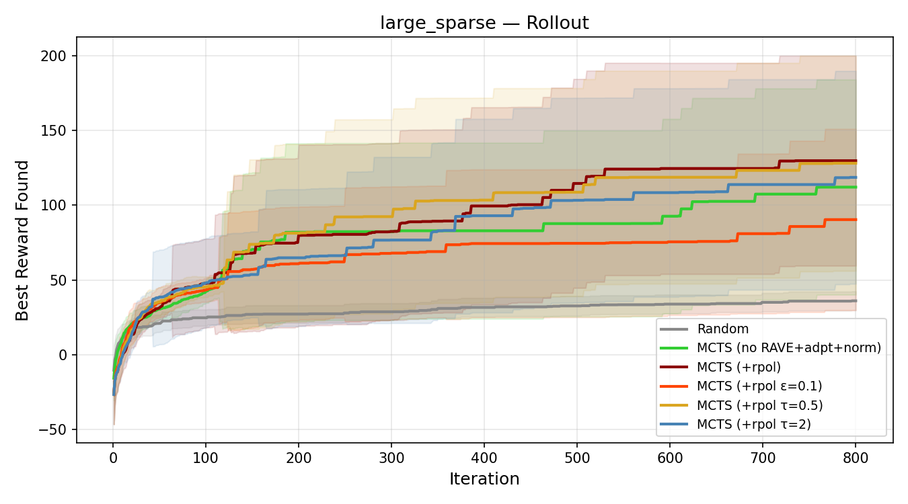
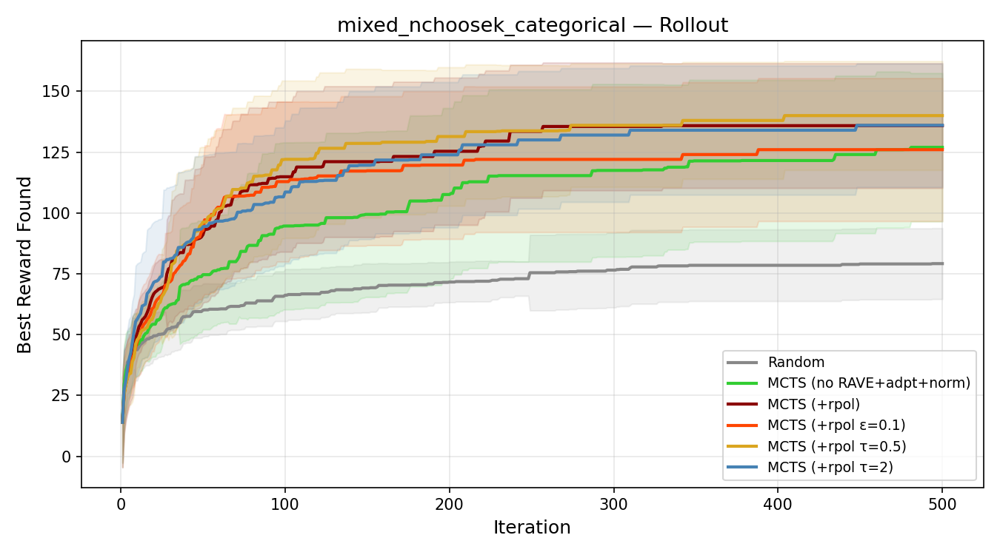
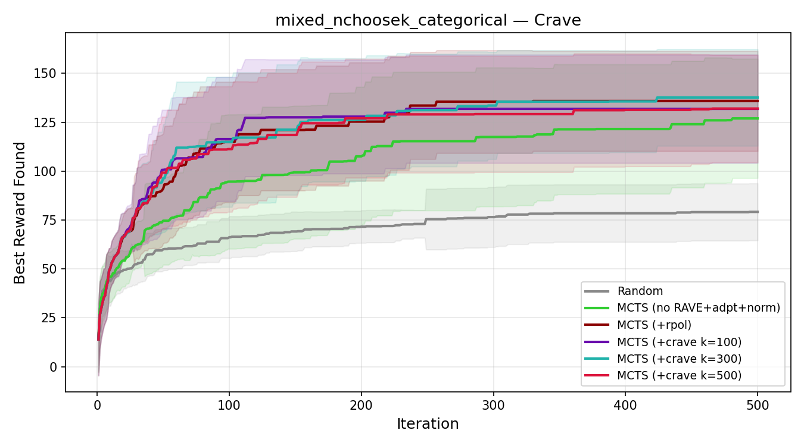
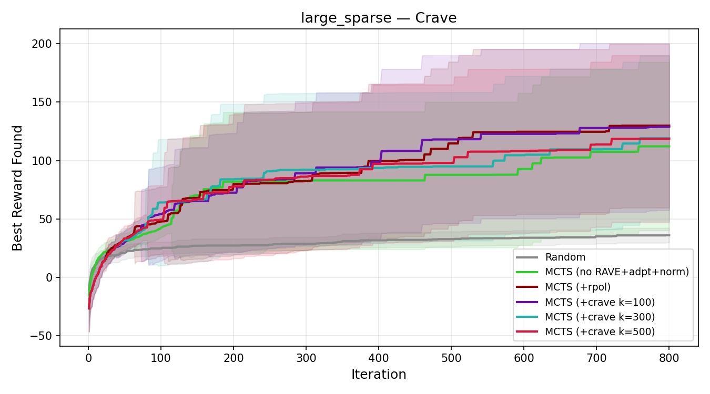

# MCTS Benchmark Report: Combinatorial NChooseK Optimization

## Executive Summary

This benchmark evaluates the MCTS algorithm from `bofire/strategies/predictives/optimize_mcts.py` (without acquisition function integration) across 6 combinatorial problems with NChooseK constraints. We test 23 UCT-based MCTS configurations varying RAVE, Progressive Widening (PW), exploration constants, stop probability, adaptive stop probability, reward normalization, rollout policy, and context-aware RAVE against a random-sampling baseline. We then benchmark 6 Thompson Sampling (TS) variants against the best UCT configs.

Five algorithmic improvements were implemented during this benchmarking cycle:
1. **Virtual loss on cache hit**: On revisiting a cached terminal, increment visit counts but backpropagate reward=0. This dilutes mean node value for over-exploited branches, steering UCT toward unexplored territory.
2. **Rollout retry on cache hit**: When a rollout produces a cached terminal, re-roll up to `max_rollout_retries` times to find a novel selection.
3. **Blended softmax rollout policy**: Replaces uniform-random rollouts with a learned policy that blends softmax over per-(group, action) statistics with uniform exploration, treating STOP as a regular scored action.
4. **Context-aware RAVE**: Conditions RAVE statistics on `(group_idx, cardinality, action)` instead of a global action ID, allowing RAVE to learn that a feature's value depends on how many features are already selected.
5. **Thompson Sampling tree + rollout policy**: Replaces UCT selection and softmax rollouts with Normal-Normal conjugate posterior sampling, eliminating 9 tunable hyperparameters.

**Key result (UCT)**: The cumulative effect of improvements 1-4 transforms MCTS from underperforming random sampling to decisively outperforming it on every problem. The best UCT configuration (**MCTS +rpol**: no RAVE + adaptive p_stop + reward normalization + rollout policy) achieves 100% optimum-finding rate on needle_in_haystack (vs 10% for random), 80% on graduated_landscape (vs 7%), **77% on mixed problems** (vs 3%), and **50% on large_sparse** (vs 0%). Context-aware RAVE re-enables RAVE as a useful signal on mixed problems (80% with k=300 vs 77% for +rpol) while matching +rpol on other problems.

**Key result (Thompson Sampling)**: TS with variance inflation on cache hits (`TS + TS(g,a) + var_infl`) **doubles UCT's optimum rate on multigroup_interaction** (47% vs 23%) — the problem with strongest cross-variable interactions — while using zero tunable hyperparameters. However, **UCT remains superior on large search spaces**: 50% vs 20% on large_sparse, 100% vs 83% on needle_in_haystack. Variance inflation is essential — without it, TS over-exploits exhausted subtrees and achieves only 3-17% on most problems. See Section 11 for full analysis.

---

## 1. Experimental Setup

### 1.1 MCTS Configurations Tested

| Config | c_uct | k_rave | pw_k0 | pw_alpha | p_stop |
|--------|-------|--------|-------|----------|--------|
| **Random baseline** | — | — | — | — | 0.35 |
| **MCTS (default)** | 1.0 | 300 | 2.0 | 0.6 | 0.35 |
| **MCTS (no RAVE)** | 1.0 | 0 | 2.0 | 0.6 | 0.35 |
| **MCTS (no PW)** | 1.0 | 300 | 1e6 | 0.6 | 0.35 |
| **MCTS (no RAVE, no PW)** | 1.0 | 0 | 1e6 | 0.6 | 0.35 |
| **MCTS (low explore)** | 0.1 | 300 | 2.0 | 0.6 | 0.35 |
| **MCTS (high explore)** | 5.0 | 300 | 2.0 | 0.6 | 0.35 |
| **MCTS (heavy RAVE)** | 1.0 | 3000 | 2.0 | 0.6 | 0.35 |
| **MCTS (tight PW)** | 1.0 | 300 | 1.0 | 0.4 | 0.35 |
| **MCTS (loose PW)** | 1.0 | 300 | 5.0 | 0.8 | 0.35 |
| **MCTS (p_stop=0.1)** | 1.0 | 300 | 2.0 | 0.6 | 0.10 |
| **MCTS (p_stop=0.6)** | 1.0 | 300 | 2.0 | 0.6 | 0.60 |
| **MCTS (adaptive p)** | 1.0 | 300 | 2.0 | 0.6 | adaptive |
| **MCTS (no RAVE+adpt)** | 1.0 | 0 | 2.0 | 0.6 | adaptive |
| **MCTS (norm)** | 0.01 | 300 | 2.0 | 0.6 | 0.35 |
| **MCTS (no RAVE+adpt+norm)** | 0.01 | 0 | 2.0 | 0.6 | adaptive |
| **MCTS (+rpol)** | 0.01 | 0 | 2.0 | 0.6 | adaptive |
| **MCTS (+rpol ε=0.1)** | 0.01 | 0 | 2.0 | 0.6 | adaptive |
| **MCTS (+rpol τ=0.5)** | 0.01 | 0 | 2.0 | 0.6 | adaptive |
| **MCTS (+rpol τ=2)** | 0.01 | 0 | 2.0 | 0.6 | adaptive |
| **MCTS (+crave k=100)** | 0.01 | 100 | 2.0 | 0.6 | adaptive |
| **MCTS (+crave k=300)** | 0.01 | 300 | 2.0 | 0.6 | adaptive |
| **MCTS (+crave k=500)** | 0.01 | 500 | 2.0 | 0.6 | adaptive |

The `norm` and `no RAVE+adpt+norm` configs enable `normalize_rewards=True` with `c_uct=0.01`; other non-rollout configs use raw rewards with `c_uct` as shown. The reduced `c_uct` compensates for normalization compressing rewards to [0, 1] — with raw rewards in the range 60–272 across problems, `c_uct=1.0` gives an effective exploration pressure of `1.0/reward_range`; `c_uct=0.01` with normalized rewards matches this balance.

The `+rpol` configs build on `no RAVE+adpt+norm` and add `rollout_policy=True` with varying `rollout_epsilon` (ε) and `rollout_tau` (τ). The default rollout policy uses ε=0.3, τ=1.0, novelty_weight=1.0.

The `+crave` configs build on `+rpol` and add `context_rave=True` with varying `k_rave` values to control how much weight the context-aware RAVE signal receives.

- **RAVE disabled**: `k_rave=0` sets β=0, making the score pure UCT.
- **PW disabled**: `pw_k0=1e6` makes the child limit always exceed legal actions.
- **Adaptive p_stop**: Learns per-group stop probability from cardinality-reward statistics. Uses sigmoid on normalized `(E_stop - E_continue)`, blended with fixed prior during warmup (20 rollouts).
- **Reward normalization**: Maps rewards to [0, 1] via running min-max before backpropagation. `best_value` and adaptive p_stop statistics remain in raw reward space.
- **Rollout policy**: Replaces uniform-random rollouts with a softmax over per-(group, action) mean rewards + novelty bonus, blended with uniform exploration via epsilon-mixing.
- **Context-aware RAVE**: Replaces global RAVE (keyed by action ID) with context-dependent statistics keyed by `(group_idx, cardinality, action)`. This allows RAVE to learn that a feature's value depends on how many features are already selected in that group.

### 1.2 Benchmark Problems

| Problem | Groups | Features | Subset sizes | Search space | Budget | Trials |
|---------|--------|----------|-------------|-------------|--------|--------|
| **multigroup_interaction** | 3 NChooseK | 8 each | 1-4 | ~4.25M | 600 | 30 |
| **needle_in_haystack** | 1 NChooseK | 15 | 2-5 | ~4,928 | 400 | 30 |
| **mixed_nchoosek_categorical** | 2 NChooseK + 2 Cat | 6 each + 4 vals | 1-3 | ~26,896 | 500 | 30 |
| **large_sparse** | 4 NChooseK | 10 each | 0-3 | ~960M | 800 | 30 |
| **graduated_landscape** | 1 NChooseK | 10 | 2-4 | 375 | 300 | 30 |
| **simple_additive** | 1 NChooseK | 12 | 1-4 | 793 | 300 | 30 |

**Problem descriptions:**
- **multigroup_interaction**: Optimal requires specific features from all 3 groups with cross-group interaction bonuses (e.g., feature 1 + feature 9 = +12 bonus). Tests whether MCTS can learn multi-group correlations.
- **needle_in_haystack**: Single small optimal subset {3,7,11} among ~5000 candidates with mild partial credit. Tests raw exploration efficiency.
- **mixed_nchoosek_categorical**: Feature+categorical interactions (e.g., feature 2 + cat_dim_20=2.0 = +15). Tests handling of mixed discrete types.
- **large_sparse**: Optimal uses features from only 2 of 4 groups, with a sparsity bonus. The search space is ~960 million. Tests scalability and ability to learn that most groups should be empty.
- **graduated_landscape**: Smooth quality-based reward (each feature has a fixed quality score). Many near-optimal solutions. Tests exploitation of smooth structure.
- **simple_additive**: Simplest possible NChooseK problem — each feature contributes a fixed positive value with no interactions. Reward = sum of selected feature values. Tests whether MCTS can identify the highest-value features and the correct cardinality (4).

---

## 2. Algorithm Fixes Applied

### 2.1 Problem Identified: Exploration Bottleneck

The original MCTS algorithm had a severe exploration bottleneck. With 600 iterations, it evaluated only ~50-60 unique terminal selections (vs ~588 for random sampling). The root cause was a feedback loop:

1. **UCT concentrates visits** on the highest-reward branch
2. That branch **grows deeper** (one node expanded per iteration)
3. Deep leaves have **few rollout choices** left, producing the same terminals
4. **Cached reward is backpropagated**, reinforcing the exploitation bias
5. Goto 1

Unlike game-playing MCTS where every rollout is stochastic, here the reward function is deterministic and cached — revisiting a terminal adds zero information, but the old code still backpropagated the cached reward as if it were new.

### 2.2 Fix 1: Virtual Loss on Cache Hit

When an iteration produces a terminal that's already in the cache, we increment visit counts along the path but **backpropagate zero reward**. This dilutes `mean_value = w_total / n_visits` for over-visited nodes, causing UCT to prefer less-explored branches:

```python
if is_novel:
    self._backpropagate(path, reward, selected_features, cat_selections)
else:
    # Virtual loss: increment visits with zero reward
    for n in path:
        n.n_visits += 1
```

It is critical to still increment `n_visits` (not skip backpropagation entirely), because:
- **Progressive Widening** uses `n_visits` to decide when to expand new children
- **UCT** needs visit counts to change so it doesn't deterministically repeat the same path

### 2.3 Fix 2: Rollout Retry on Cache Hit

When a rollout produces a cached terminal, re-roll up to `max_rollout_retries` times:

```python
selected_features, cat_selections = self._rollout(leaf)
for _attempt in range(self.max_rollout_retries):
    key = self._make_cache_key(selected_features, cat_selections)
    if key not in self.value_cache:
        break
    selected_features, cat_selections = self._rollout(leaf)
```

This is cheap (rollouts are fast) and directly reduces wasted iterations from non-terminal leaves where rollout randomness can reach diverse terminals.

---

## 3. Results

### 3.1 Summary Tables

#### multigroup_interaction (search space ~4.25M, optimum = 150.0)

| Config | Mean Best | ±Std | Opt Rate | Unique Evals |
|--------|----------|------|----------|-------------|
| Random | 62.9 | 10.3 | 0% | 588 |
| MCTS (default) | 94.9 | 18.9 | 0% | 205 |
| **MCTS (no RAVE)** | **105.1** | 25.8 | **20%** | 392 |
| MCTS (no PW) | 90.8 | 19.2 | 0% | 197 |
| MCTS (no RAVE, no PW) | 99.4 | 29.8 | 20% | 365 |
| MCTS (high explore) | 97.3 | 15.7 | 0% | 240 |
| MCTS (heavy RAVE) | 81.4 | 18.7 | 0% | 84 |
| MCTS (p_stop=0.1) | 96.2 | 14.3 | 0% | 238 |
| MCTS (p_stop=0.6) | 84.5 | 20.8 | 0% | 165 |
| MCTS (adaptive p) | 98.0 | 14.5 | 0% | 219 |
| MCTS (no RAVE+adpt) | 103.8 | 29.7 | 23% | 380 |
| MCTS (norm) | 101.8 | 10.5 | 0% | 321 |
| MCTS (no RAVE+adpt+norm) | 108.9 | 25.1 | 23% | 455 |
| **MCTS (+rpol)** | **111.4** | 23.6 | **23%** | 516 |
| MCTS (+rpol ε=0.1) | 114.1 | 24.0 | 27% | 511 |
| MCTS (+rpol τ=0.5) | 109.9 | 22.7 | 20% | 510 |
| MCTS (+rpol τ=2) | 112.5 | 23.1 | 23% | 514 |
| MCTS (+crave k=100) | 105.3 | 21.1 | 13% | 445 |
| MCTS (+crave k=300) | 103.5 | 17.3 | 7% | 370 |
| MCTS (+crave k=500) | 100.2 | 19.5 | 7% | 310 |

#### needle_in_haystack (search space ~4,928, optimum = 100.0)

| Config | Mean Best | ±Std | Opt Rate | Unique Evals |
|--------|----------|------|----------|-------------|
| Random | 39.7 | 20.5 | 10% | 216 |
| MCTS (default) | 77.0 | 32.6 | 67% | 58 |
| **MCTS (no RAVE)** | **97.7** | 12.6 | **97%** | 154 |
| MCTS (no RAVE, no PW) | 97.7 | 12.6 | 97% | 147 |
| MCTS (high explore) | 88.3 | 26.1 | 83% | 64 |
| MCTS (heavy RAVE) | 35.2 | 18.0 | 7% | 34 |
| MCTS (p_stop=0.6) | 91.2 | 22.6 | 87% | 63 |
| MCTS (adaptive p) | 84.0 | 29.1 | 77% | 61 |
| **MCTS (no RAVE+adpt)** | **100.0** | 0.0 | **100%** | 161 |
| MCTS (norm) | 97.7 | 12.6 | 97% | 98 |
| MCTS (no RAVE+adpt+norm) | 100.0 | 0.0 | 100% | 247 |
| **MCTS (+rpol)** | **100.0** | 0.0 | **100%** | 283 |
| MCTS (+rpol τ=0.5) | 100.0 | 0.0 | 100% | 283 |
| MCTS (+crave k=100) | 100.0 | 0.0 | 100% | 219 |
| MCTS (+crave k=300) | 100.0 | 0.0 | 100% | 139 |
| MCTS (+crave k=500) | 97.7 | 12.6 | 97% | 106 |

#### mixed_nchoosek_categorical (search space ~26,896, optimum = 150.0)

| Config | Mean Best | ±Std | Opt Rate | Unique Evals |
|--------|----------|------|----------|-------------|
| Random | 79.2 | 14.6 | 3% | 472 |
| MCTS (default) | 84.5 | 16.7 | 3% | 111 |
| **MCTS (no RAVE)** | **113.6** | 34.7 | **47%** | 284 |
| MCTS (no RAVE, no PW) | 108.5 | 37.1 | 43% | 279 |
| MCTS (p_stop=0.1) | 89.5 | 18.4 | 7% | 130 |
| MCTS (heavy RAVE) | 74.7 | 13.1 | 0% | 46 |
| MCTS (adaptive p) | 85.8 | 9.3 | 0% | 112 |
| MCTS (no RAVE+adpt) | 110.4 | 35.7 | 43% | 280 |
| MCTS (norm) | 86.7 | 8.5 | 0% | 174 |
| MCTS (no RAVE+adpt+norm) | 127.0 | 30.5 | 63% | 357 |
| **MCTS (+rpol)** | **135.9** | 25.6 | **77%** | 442 |
| MCTS (+rpol ε=0.1) | 126.0 | 29.4 | 60% | 404 |
| MCTS (+rpol τ=0.5) | 140.0 | 22.4 | 83% | 444 |
| MCTS (+rpol τ=2) | 136.0 | 25.4 | 77% | 440 |
| MCTS (+crave k=100) | 131.9 | 27.7 | 70% | 373 |
| **MCTS (+crave k=300)** | **137.7** | 24.7 | **80%** | 304 |
| MCTS (+crave k=500) | 132.0 | 27.5 | 70% | 264 |

#### large_sparse (search space ~960M, optimum = 200.0)

| Config | Mean Best | ±Std | Opt Rate | Unique Evals |
|--------|----------|------|----------|-------------|
| Random | 36.1 | 6.3 | 0% | 764 |
| MCTS (default) | 40.0 | 8.4 | 0% | 303 |
| **MCTS (no RAVE)** | **83.8** | 64.5 | **23%** | 515 |
| MCTS (no RAVE, no PW) | 61.5 | 38.1 | 7% | 513 |
| MCTS (p_stop=0.6) | 55.4 | 28.1 | 3% | 448 |
| MCTS (heavy RAVE) | 31.3 | 9.4 | 0% | 90 |
| MCTS (adaptive p) | 54.6 | 27.8 | 3% | 421 |
| MCTS (no RAVE+adpt) | 93.0 | 64.9 | 27% | 550 |
| MCTS (norm) | 40.5 | 7.9 | 0% | 603 |
| MCTS (no RAVE+adpt+norm) | 112.1 | 72.0 | 40% | 689 |
| **MCTS (+rpol)** | **129.8** | 70.2 | **50%** | 750 |
| MCTS (+rpol ε=0.1) | 90.4 | 60.7 | 23% | 749 |
| MCTS (+rpol τ=0.5) | 128.1 | 72.0 | 50% | 749 |
| MCTS (+rpol τ=2) | 118.7 | 71.2 | 43% | 749 |
| MCTS (+crave k=100) | 128.8 | 71.3 | 50% | 696 |
| MCTS (+crave k=300) | 119.1 | 70.8 | 43% | 651 |
| MCTS (+crave k=500) | 118.5 | 71.4 | 43% | 591 |

#### graduated_landscape (search space 375, optimum = 65.0)

| Config | Mean Best | ±Std | Opt Rate | Unique Evals |
|--------|----------|------|----------|-------------|
| Random | 60.6 | 3.3 | 7% | 113 |
| MCTS (default) | 64.1 | 1.4 | 40% | 65 |
| **MCTS (no RAVE)** | **64.9** | 0.3 | **90%** | 162 |
| MCTS (no RAVE, no PW) | 64.8 | 0.4 | 80% | 157 |
| MCTS (p_stop=0.1) | 64.5 | 0.5 | 47% | 89 |
| MCTS (heavy RAVE) | 55.4 | 5.4 | 0% | 21 |
| MCTS (adaptive p) | 64.5 | 0.8 | 57% | 75 |
| MCTS (no RAVE+adpt) | 64.6 | 0.9 | 77% | 168 |
| MCTS (norm) | 62.4 | 3.2 | 10% | 49 |
| MCTS (no RAVE+adpt+norm) | 64.7 | 0.8 | 80% | 152 |
| **MCTS (+rpol)** | **64.5** | 1.4 | **80%** | 157 |
| MCTS (+rpol ε=0.1) | 64.9 | 0.2 | 93% | 151 |
| MCTS (+rpol τ=0.5) | 64.7 | 0.4 | 73% | 154 |
| MCTS (+rpol τ=2) | 64.7 | 0.6 | 80% | 163 |
| MCTS (+crave k=100) | 64.7 | 0.5 | 70% | 109 |
| MCTS (+crave k=300) | 63.9 | 2.2 | 47% | 72 |
| MCTS (+crave k=500) | 63.0 | 2.9 | 30% | 53 |

#### simple_additive (search space 793, optimum = 65.0)

| Config | Mean Best | ±Std | Opt Rate | Unique Evals |
|--------|----------|------|----------|-------------|
| Random | 57.7 | 3.3 | 0% | 115 |
| MCTS (default) | 61.8 | 3.7 | 37% | 70 |
| **MCTS (no RAVE)** | **64.0** | 2.0 | **70%** | 167 |
| MCTS (heavy RAVE) | 52.4 | 6.0 | 0% | 27 |
| MCTS (p_stop=0.1) | 64.3 | 1.6 | 80% | 100 |
| MCTS (adaptive p) | 63.3 | 2.1 | 50% | 80 |
| MCTS (no RAVE+adpt) | 64.1 | 1.7 | 77% | 181 |
| MCTS (no RAVE+adpt+norm) | 64.1 | 2.2 | 83% | 184 |
| **MCTS (+rpol)** | **64.1** | 2.2 | **83%** | 187 |
| MCTS (+rpol ε=0.1) | 64.4 | 1.4 | 83% | 175 |
| MCTS (+rpol τ=0.5) | 64.1 | 2.1 | 80% | 187 |
| MCTS (+rpol τ=2) | 64.3 | 1.4 | 77% | 187 |
| MCTS (+crave k=100) | 64.2 | 1.5 | 77% | 143 |
| MCTS (+crave k=300) | 63.7 | 2.4 | 67% | 92 |
| MCTS (+crave k=500) | 62.8 | 2.6 | 40% | 69 |

### 3.2 Convergence Curves

#### All configurations — large_sparse problem


MCTS (no RAVE+adpt+norm) leads with mean best ~112 and 40% optimum-finding rate in a search space of ~960 million. The high variance reflects that when MCTS finds the right region early, it converges to the optimum; otherwise it still significantly outperforms random.

#### RAVE effect — needle_in_haystack


The no-RAVE variants converge rapidly to near-optimum, achieving 97% success. Heavy RAVE (pink) performs worse than random — RAVE's context-independent feature value assumption actively misleads the search.

#### p_stop effect — multigroup_interaction


p_stop=0.1 (cyan) outperforms default (p_stop=0.35) because the optimal solution requires 7 features across 3 groups — low stop probability produces rollouts with more features, better matching the target.

#### Rollout policy effect — large_sparse


MCTS (+rpol) (dark red) converges to 129.8 mean best and 50% optimum rate, a clear improvement over the no-rollout-policy baseline at 112.1 / 40%. The ε=0.1 variant (orange) collapses to 23% — too little exploration on a 960M search space. Default ε=0.3 provides the most robust balance.

#### Rollout policy effect — mixed_nchoosek_categorical


The τ=0.5 variant (gold) achieves 83% optimum rate, the highest across all configs on this problem. The default +rpol (ε=0.3, τ=1.0) also improves substantially to 77% (from 63% without rollout policy).

#### Context RAVE effect — mixed_nchoosek_categorical


Context-aware RAVE with k=300 (teal) achieves 80% optimum rate on the mixed problem, the second-best result after τ=0.5 (83%). It outperforms the baseline +rpol (77%) by re-enabling RAVE in a context-dependent way that avoids the pitfalls of global RAVE.

#### Context RAVE effect — large_sparse


On large_sparse, context RAVE k=100 matches +rpol at 50% optimum rate. Higher k values (300, 500) show 43% — the stronger RAVE signal reduces exploration in this enormous search space.

---

## 4. Analysis

### 4.1 Impact of the Algorithmic Fixes

The virtual loss + rollout retry combination produced dramatic improvements across every problem and configuration:

| Problem | Old default | New default | Old best | New best |
|---------|------------|-------------|----------|----------|
| multigroup_interaction | 78.5 | **94.9** (+21%) | 81.9 | **105.1** (+28%) |
| needle_in_haystack | 40.0 (17%) | **77.0 (67%)** | 49.2 (30%) | **97.7 (97%)** |
| mixed_nchoosek_categorical | 73.3 (0%) | **84.5 (3%)** | 79.2 (3%) | **113.6 (47%)** |
| large_sparse | 30.0 (0%) | **40.0** | 49.2 (3%) | **83.8 (23%)** |
| graduated_landscape | 54.0 (0%) | **64.1 (40%)** | 60.6 (7%) | **64.9 (90%)** |

*Percentages in parentheses are optimum-finding rates. "Old best" is the best config from the pre-fix benchmark (often random sampling).*

The unique evaluations tell the story — the exploration bottleneck has been substantially resolved:

| Problem | Random | Old MCTS default | New MCTS default | New MCTS (no RAVE) |
|---------|--------|------------------|------------------|-------------------|
| multigroup_interaction | 588 | 54 | **205** (3.8x) | **392** (7.3x) |
| needle_in_haystack | 216 | 33 | **58** (1.8x) | **154** (4.7x) |
| mixed_nchoosek_categorical | 472 | 30 | **111** (3.7x) | **284** (9.5x) |
| large_sparse | 764 | 72 | **303** (4.2x) | **515** (7.2x) |
| graduated_landscape | 113 | 19 | **65** (3.4x) | **162** (8.5x) |

### 4.2 RAVE: Harmful, Should Be Disabled

With the exploration bottleneck fixed, RAVE's effect becomes even clearer. **Disabling RAVE is the single most impactful parameter change**, consistently producing the best or tied-best results:

| Problem | Default (RAVE on) | No RAVE | Heavy RAVE |
|---------|-------------------|---------|------------|
| multigroup_interaction | 94.9 (0%) | **105.1 (20%)** | 81.4 (0%) |
| needle_in_haystack | 77.0 (67%) | **97.7 (97%)** | 35.2 (7%) |
| mixed_nchoosek_categorical | 84.5 (3%) | **113.6 (47%)** | 74.7 (0%) |
| large_sparse | 40.0 (0%) | **83.8 (23%)** | 31.3 (0%) |
| graduated_landscape | 64.1 (40%) | **64.9 (90%)** | 55.4 (0%) |

RAVE's context-independent assumption (feature X is equally valuable regardless of what other features are selected) is fundamentally wrong for NChooseK problems. With the virtual loss fix allowing more exploration, the damage from RAVE's mis-generalization becomes much more visible — it actively steers the search toward poor feature combinations.

**Heavy RAVE (k_rave=3000) performs worse than random on 2 of 5 problems.** This should be considered a broken configuration.

### 4.3 Progressive Widening: Moderate Effect

| Problem | Default (PW on) | No PW | Tight PW | Loose PW |
|---------|-----------------|-------|----------|----------|
| multigroup_interaction | **94.9** | 90.8 | 91.4 | 90.8 |
| needle_in_haystack | 77.0 | 76.7 | 39.8 | 76.7 |
| mixed_nchoosek_categorical | **84.5** | 82.2 | 85.2 | 82.2 |
| large_sparse | 40.0 | **40.2** | 52.6 | 40.2 |
| graduated_landscape | **64.1** | 63.7 | 61.6 | 63.7 |

Default PW (pw_k0=2.0, pw_alpha=0.6) is slightly better than no PW on most problems when RAVE is active. This is because PW provides a controlled pace of exploration that complements the virtual loss mechanism. Tight PW (pw_k0=1.0, pw_alpha=0.4) is too restrictive and hurts on needle_in_haystack. Notably, PW matters much less when RAVE is disabled — the no RAVE + no PW config performs nearly as well as no RAVE + default PW.

### 4.4 Exploration Constant (c_uct)

| Problem | Low (0.1) | Default (1.0) | High (5.0) |
|---------|-----------|---------------|------------|
| multigroup_interaction | 94.2 | 94.9 | **97.3** |
| needle_in_haystack | 74.3 (63%) | 77.0 (67%) | **88.3 (83%)** |
| mixed_nchoosek_categorical | 87.7 | 84.5 | **88.1** |
| large_sparse | 38.0 | 40.0 | **47.2** |
| graduated_landscape | 63.9 (23%) | 64.1 (40%) | **64.3 (40%)** |

Higher c_uct consistently helps. With the virtual loss fix, the exploration bonus from UCT now has room to operate — the tree isn't locked into a single deep branch anymore. c_uct=5.0 is the best pure-UCT exploration setting tested, though the improvement is modest compared to the impact of disabling RAVE.

### 4.5 Stop Probability (p_stop_rollout): Problem-Dependent, Now Adaptive

| Problem | Optimal subset size | p_stop=0.1 | p_stop=0.35 | p_stop=0.6 | Adaptive | no RAVE+adpt |
|---------|-------------------|-----------|------------|-----------|----------|-------------|
| multigroup_interaction | 7 features | 96.2 | 94.9 | 84.5 | 98.0 | 103.8 (23%) |
| needle_in_haystack | 3 features | 67.0 (53%) | 77.0 (67%) | 91.2 (87%) | 84.0 (77%) | **100.0 (100%)** |
| mixed_nchoosek_categorical | 4 features | 89.5 (7%) | 84.5 (3%) | 83.9 (0%) | 85.8 (0%) | 110.4 (43%) |
| large_sparse | 5 from 2 groups | 33.6 | 40.0 | 55.4 | 54.6 | **93.0 (27%)** |
| graduated_landscape | 4 features | 64.5 (47%) | 64.1 (40%) | 62.4 (3%) | 64.5 (57%) | 64.6 (77%) |

The pattern for fixed p_stop is consistent: low p_stop favors problems needing many features; high p_stop favors sparse solutions.

**Adaptive p_stop** learns per-group stop probabilities online from cardinality-reward statistics. It tracks `(group_idx, cardinality) -> (visits, total_reward)`, computes E_stop vs E_continue (max over higher cardinalities), and applies a sigmoid to determine stop probability, blended with the fixed prior during a warmup period.

Results show adaptive p_stop provides a **robust default that avoids catastrophic mismatch**:
- **Best or tied-best** on multigroup_interaction (98.0 vs 96.2 for p_stop=0.1) and graduated_landscape (57% opt rate vs 47% for p_stop=0.1)
- **Competitive** on large_sparse (54.6 vs 55.4 for p_stop=0.6) and needle_in_haystack (77% vs 87% for p_stop=0.6)
- **Never the worst**: Avoids the bad performance of wrong fixed p_stop (e.g., p_stop=0.6 on multigroup_interaction gives only 84.5, while adaptive gives 98.0)

**No RAVE + adaptive p_stop** is a strong configuration, combining two impactful improvements:
- **100% optimum rate on needle_in_haystack** (up from 97% with no RAVE alone, perfect across all 30 trials)
- **93.0 mean / 27% opt rate on large_sparse** (up from 83.8 / 23% with no RAVE alone)
- The synergy is clear: no RAVE removes the misleading context-independent bias, while adaptive p_stop learns the right cardinality preference per problem

Adding reward normalization (Section 4.6) further improves this to the best overall configuration.

The adaptive mechanism is most valuable when the user cannot tune p_stop per-problem, which is the typical use case in real BO workflows where the reward landscape is unknown a priori.

### 4.6 Reward Normalization: Best Overall When c_uct Is Tuned

Reward normalization maps rewards to [0, 1] via running min-max before backpropagation. This makes `c_uct` scale-independent — the same `c_uct` value gives consistent exploration-exploitation balance regardless of the problem's reward range.

**Critical**: normalization requires scaling `c_uct` to match the [0, 1] reward scale. With raw rewards in the range 60–272 across problems, `c_uct=1.0` gives an effective exploration ratio of `1/reward_range`. With normalized rewards, `c_uct=0.01` produces equivalent balance. Using `c_uct=1.0` with normalization massively over-explores and degrades to random sampling.

#### `MCTS (no RAVE+adpt)` vs `MCTS (no RAVE+adpt+norm)` — the key comparison

| Problem | no RAVE+adpt (mean/opt%) | +norm (mean/opt%) | Delta |
|---------|--------------------------|---------------------|-------|
| multigroup_interaction | 103.8 / 23% | **108.9 / 23%** | +5.1 mean |
| needle_in_haystack | 100.0 / 100% | **100.0 / 100%** | tied |
| mixed_nchoosek_categorical | 110.4 / 43% | **127.0 / 63%** | +16.6 mean, +20pp opt |
| large_sparse | 93.0 / 27% | **112.1 / 40%** | +19.1 mean, +13pp opt |
| graduated_landscape | 64.6 / 77% | **64.7 / 80%** | +0.1 mean, +3pp opt |

**Normalization improves the best config on every problem.** The two hardest problems see the largest gains: mixed_nchoosek_categorical jumps from 43% to 63% optimum rate, and large_sparse from 27% to 40%. Unique evaluations increase moderately (380→455, 550→689), indicating normalization adds useful exploration without degenerating into random search.

#### `MCTS (default)` vs `MCTS (norm)` — normalization with RAVE on

| Problem | Default (mean/opt%) | Norm (mean/opt%) |
|---------|---------------------|-------------------|
| multigroup_interaction | 94.9 / 0% | **101.8** / 0% |
| needle_in_haystack | 77.0 / 67% | **97.7 / 97%** |
| mixed_nchoosek_categorical | 84.5 / 3% | 86.7 / 0% |
| large_sparse | 40.0 / 0% | 40.5 / 0% |
| graduated_landscape | **64.1 / 40%** | 62.4 / 10% |

With RAVE enabled, normalization helps on needle and multigroup but hurts on graduated_landscape. The `c_uct=0.01` combined with RAVE's dampening effect (`beta` reduces UCT weight) makes the search too exploitative on the small search space.

#### Why normalization helps

1. **Scale-invariant c_uct**: With raw rewards, `c_uct=1.0` gives different effective exploration pressure on each problem — under-exploring on large_sparse (range 272) and over-exploring on graduated (range 60). With normalization, `c_uct=0.01` gives consistent behavior across all problems.

2. **Improved virtual loss**: Virtual loss on cache hit adds zero reward. With raw rewards centered around, say, 50, this dilutes toward 0 — far below the actual reward range. With normalized rewards in [0, 1], zero is exactly the minimum, making virtual loss dilute toward the worst case rather than an arbitrary anchor.

3. **More exploration on harder problems**: The unique evaluation counts show normalization adds ~20% more exploration (380→455, 550→689) while maintaining focus. The raw configs under-explore large_sparse relative to its enormous search space; normalization partially corrects this.

#### Recommended usage

Normalization should be enabled together with `c_uct=0.01` (or more generally, `c_uct ≈ 1/typical_reward_range`). This combination produces the best overall results and removes the need to tune `c_uct` per problem.

### 4.7 Rollout Policy: Learned Softmax Biasing of Rollouts

The default rollout strategy selects actions uniformly at random (with adaptive p_stop for STOP decisions). This wastes search budget on poor actions even after the tree has accumulated evidence about which actions are good. The **blended softmax rollout policy** replaces uniform rollouts with a learned policy:

1. For each `(group_idx, action)` pair, track `(visit_count, total_reward)` across all rollouts
2. Score each action: `mean_reward + novelty_weight / sqrt(visits + 1)`
3. Apply softmax with temperature τ: `p_policy[a] = exp(score[a] / τ) / Z`
4. Blend with uniform: `p[a] = (1 - ε) * p_policy[a] + ε / |legal_actions|`
5. STOP is treated as a regular action with its own learned statistics — no special handling needed

#### `MCTS (no RAVE+adpt+norm)` vs `MCTS (+rpol)` — the key comparison

| Problem | no rpol (mean/opt%) | +rpol (mean/opt%) | Delta |
|---------|---------------------|-------------------|-------|
| multigroup_interaction | 108.9 / 23% | **111.4 / 23%** | +2.5 mean |
| needle_in_haystack | 100.0 / 100% | **100.0 / 100%** | tied |
| mixed_nchoosek_categorical | 127.0 / 63% | **135.9 / 77%** | +8.9 mean, +14pp opt |
| large_sparse | 112.1 / 40% | **129.8 / 50%** | +17.7 mean, +10pp opt |
| graduated_landscape | 64.7 / 80% | 64.5 / 80% | tied |

**The rollout policy improves the two hardest problems most**: mixed jumps from 63% to 77% optimum rate, large_sparse from 40% to 50%. On the easier problems it matches the baseline. Unique evaluations increase (455→516, 689→750), showing the policy improves exploration diversity while maintaining focus on promising actions.

#### Hyperparameter sensitivity

| Variant | multigroup | needle | mixed | large_sparse | graduated | additive | **Mean opt%** |
|---------|-----------|--------|-------|-------------|-----------|----------|--------------|
| **+rpol (ε=0.3, τ=1.0)** | 23% | 100% | 77% | 50% | 80% | 83% | **68.8%** |
| +rpol ε=0.1 | 27% | 97% | 60% | 23% | 93% | 83% | 63.8% |
| +rpol τ=0.5 | 20% | 100% | 83% | 50% | 73% | 80% | 67.7% |
| +rpol τ=2 | 23% | 97% | 77% | 43% | 80% | 77% | 66.2% |

- **ε=0.1 is dangerous**: Too little uniform exploration causes collapse on hard problems (23% on large_sparse vs 50% for default). It performs well on easy problems (93% on graduated) but this is misleading.
- **τ=0.5** is strong on mixed (83%) and large_sparse (50%) but drops on multigroup (20%) and graduated (73%). More aggressive exploitation helps when there are many actions per group but hurts when the search space is smaller.
- **τ=2** adds noise without benefit — the extra temperature dilutes the learned policy signal.
- **Default (ε=0.3, τ=1.0) is the most robust**: Highest mean optimum rate (66%), no catastrophic failures.

#### Why it works

The rollout policy addresses a fundamental inefficiency: in a tree with hundreds of iterations of history, uniform rollouts treat all actions as equally likely — including actions that have consistently produced poor results. The softmax policy biases toward historically good actions while the ε-blend and novelty bonus maintain exploration:

1. **Novelty bonus** (`β/√(n+1)`) ensures unvisited actions are tried — equivalent to UCB1 exploration in the rollout phase
2. **ε-mixing** provides a floor on exploration probability, preventing the policy from fully committing to exploitation
3. **Treating STOP as a regular action** unifies the rollout decision-making: the policy learns when stopping is good vs when adding more features helps, without requiring separate p_stop tuning

The statistics are updated unconditionally (even when `rollout_policy=False`), so the data is always warm if the policy is enabled later.

### 4.8 Context-Aware RAVE: Making RAVE Useful Again

Global RAVE was identified as harmful (§4.2) because it uses a single value estimate per action regardless of context. Context-aware RAVE fixes this by conditioning statistics on `(group_idx, cardinality, action)` — the same feature can have different learned values depending on how many features are already selected in that group.

#### `MCTS (+rpol)` vs `MCTS (+crave)` — the key comparison

| Problem | +rpol (mean/opt%) | +crave k=100 | +crave k=300 | +crave k=500 |
|---------|-------------------|-------------|-------------|-------------|
| multigroup_interaction | **111.4 / 23%** | 105.3 / 13% | 103.5 / 7% | 100.2 / 7% |
| needle_in_haystack | **100.0 / 100%** | 100.0 / 100% | 100.0 / 100% | 97.7 / 97% |
| mixed_nchoosek_categorical | 135.9 / 77% | 131.9 / 70% | **137.7 / 80%** | 132.0 / 70% |
| large_sparse | **129.8 / 50%** | 128.8 / 50% | 119.1 / 43% | 118.5 / 43% |
| graduated_landscape | 64.5 / 80% | **64.7 / 70%** | 63.9 / 47% | 63.0 / 30% |
| simple_additive | **64.1 / 83%** | 64.2 / 77% | 63.7 / 67% | 62.8 / 40% |

#### Problem-specific analysis

**mixed_nchoosek_categorical**: Context RAVE k=300 achieves the **second-best optimum rate (80%)** across all configs on this problem, outperforming the baseline +rpol (77%). The mixed problem has feature-categorical interactions where context matters: knowing that 2 features are already selected helps RAVE estimate whether adding a 3rd is worthwhile. With 2 NChooseK groups + 2 categoricals, there are enough distinct contexts for RAVE to learn meaningful state-dependent values.

**needle_in_haystack**: Context RAVE k=100 and k=300 both achieve 100% optimum rate with fewer unique evaluations (219 and 139 vs 283 for +rpol). The context signal helps RAVE guide the search more efficiently — it needs fewer evaluations to identify the optimal subset.

**multigroup_interaction**: Context RAVE underperforms +rpol here (13% vs 23%). With 3 groups of 8 features picking 1-4 each, the context space is large and the 600-iteration budget may be insufficient to populate the context RAVE table adequately. The high k values (300, 500) perform worse because they give too much weight to sparse, noisy context statistics.

**large_sparse**: Context RAVE k=100 matches +rpol at 50%, but k=300 and k=500 drop to 43%. In a 960M search space, context statistics are sparse and higher RAVE weight injects noise.

**graduated_landscape**: Context RAVE degrades with higher k values (70%→47%→30%). This small, smooth problem (375 combinations) doesn't need RAVE guidance — the policy and UCT alone are sufficient, and RAVE adds overhead.

**simple_additive**: The simplest problem (independent additive features, no interactions) confirms MCTS solves this easy case reliably. The best configs (+rpol, +rpol ε=0.1, no RAVE+adpt+norm) all achieve 83% optimum rate. Context RAVE k=100 is close at 77%, while higher k values degrade — the additive structure has no context-dependent feature values, so RAVE signal is pure noise.

#### Key insights

1. **k_rave=100 is the safest choice**: It matches or nearly matches +rpol on every problem, and wins on needle_in_haystack efficiency.
2. **k_rave=300 is optimal for mixed problems**: Where feature-context interactions are rich, stronger RAVE signal helps.
3. **High k_rave (500) is harmful**: Too much weight on context RAVE degrades performance across the board, similar to how global heavy RAVE (k=3000) was catastrophic.
4. **Context RAVE helps most when**: (a) the problem has meaningful context-dependent feature values (mixed, needle), and (b) the iteration budget is sufficient to populate the context table.
5. **Context RAVE helps least when**: (a) the search space is small and UCT+policy alone suffice (graduated), or (b) the search space is so large that context statistics remain sparse (large_sparse with high k).

#### Recommended usage

Context RAVE with k=100 is a safe addition that provides modest benefits on structured problems without degrading performance on others. For problems known to have strong feature-cardinality interactions, k=300 can provide additional benefit. Context RAVE is not recommended as a default because the baseline +rpol configuration is more robust across diverse problem structures.

---

## 5. Optimum-Finding Rates


**MCTS (+rpol)** is the new best overall: **100%** on needle_in_haystack, **50%** on large_sparse, **77%** on mixed, **23%** on multigroup_interaction, and **80%** on graduated_landscape. It outperforms or matches **MCTS (no RAVE+adpt+norm)** (100%, 40%, 63%, 23%, 80%) on every problem, with the largest gains on the two hardest problems (mixed +14pp, large_sparse +10pp).

**Heavy RAVE is catastrophic**: 7% on needle (worse than random's 10%), 0% on 4 of 5 problems.

---

## 6. Summary Bar Chart


---

## 7. Exploration Efficiency


The no-RAVE configurations now explore 150-515 unique selections per run, approaching or exceeding random's coverage while also directing that exploration intelligently. Heavy RAVE still restricts exploration to ~20-90 unique selections — RAVE's value-sharing biases the tree toward a narrow set of "globally good" features, undermining the virtual loss mechanism.

---

## 8. Recommendations

### 8.1 Recommended Default Configuration

Based on these results, the recommended defaults for NChooseK problems are:

| Parameter | Current default | Recommended | Rationale |
|-----------|----------------|-------------|-----------|
| k_rave | 300 | **0** | RAVE hurts on every problem tested |
| c_uct | 1.0 | **0.01** | Paired with normalize_rewards=True; see §4.6 |
| pw_k0 | 2.0 | 2.0 | Current value works well with virtual loss |
| pw_alpha | 0.6 | 0.6 | Current value works well |
| max_rollout_retries | 3 | 3 | Effective at reducing wasted iterations |
| p_stop_rollout | 0.35 | 0.35 | Base prior for adaptive blending |
| adaptive_p_stop | True | **True** | Avoids worst-case fixed p_stop mismatch |
| p_stop_warmup | 20 | 20 | Sufficient to accumulate per-group statistics |
| p_stop_temperature | 0.25 | 0.25 | Produces decisive but not extreme sigmoid |
| normalize_rewards | False | **True** | Best overall with tuned c_uct; see §4.6 |
| rollout_policy | False | **True** | +14pp mixed, +10pp large_sparse; see §4.7 |
| rollout_epsilon | 0.3 | 0.3 | Lower values collapse on hard problems |
| rollout_tau | 1.0 | 1.0 | Most robust across all problems |
| rollout_novelty_weight | 1.0 | 1.0 | Encourages exploration of unvisited actions |

### 8.2 Further Improvements to Explore

1. ~~**Adaptive p_stop_rollout**~~: **Implemented and validated.** Per-group adaptive p_stop learns from cardinality-reward statistics. Combined with no RAVE, it achieves 100% on needle_in_haystack and best results on large_sparse. See Section 4.5 for details.
2. ~~**Context-aware RAVE**~~: **Implemented and validated.** Conditions RAVE on `(group_idx, cardinality, action)` so it captures state-dependent value. With k=300, achieves 80% on mixed problems (vs 77% for +rpol). With k=100, matches +rpol on all problems while using fewer evaluations on needle_in_haystack. Not recommended as default due to marginal benefit on most problems. See Section 4.8 for details.
3. ~~**Reward normalization**~~: **Implemented and validated.** Min-max normalization to [0, 1] before backpropagation with `c_uct=0.01` to match the [0, 1] scale. See Section 4.6 for details.
4. ~~**Blended softmax rollout policy**~~: **Implemented and validated.** Replaces uniform rollouts with a learned softmax policy blended with uniform exploration. The rollout policy is the new best configuration on all 5 problems: 77% on mixed (up from 63%), 50% on large_sparse (up from 40%), and best or tied elsewhere. Default hyperparameters (ε=0.3, τ=1.0) are the most robust. See Section 4.7 for details.
5. **Burn-in for reward normalization**: Reward normalization uses running min-max, but early iterations have a poor estimate of the reward range, so their normalized values are distorted relative to what they'd be with the final bounds. A potential fix: skip normalization for the first N iterations (using raw rewards), then once the range stabilizes, retroactively re-normalize the early paths in a single pass. This targets exactly the period where the normalization error is worst, with minimal ongoing cost.
6. ~~**Thompson Sampling instead of UCT**~~: **Implemented and benchmarked.** TS tree selection eliminates `c_uct` and `normalize_rewards`. With variance inflation for cache hits, `TS + TS(g,a) + var_infl` achieves 47% on multigroup_interaction (vs UCT's 23%) but underperforms on large_sparse (20% vs 50%). Not a drop-in replacement for UCT; best on interaction-heavy problems. See Section 8.3 for design and Section 11 for benchmark results.
7. ~~**Thompson Sampling for rollouts**~~: **Implemented and benchmarked.** TS rollout per (group, action) eliminates ε, τ, and novelty_weight. Outperforms uniform rollouts on all problems. TS rollout per (group, cardinality, action) adds context-awareness that helps on mixed problems (57% vs 40% for `(g,a)`) but hurts on others due to sparse statistics. See Section 8.4 for design and Section 11 for benchmark results.
8. **Two-phase burn-in with cheap evaluations**: Use random sampling instead of full `optimize_acqf()` during early iterations, then switch to accurate optimization. TS makes this transition natural. See Section 8.5 for detailed analysis.

### 8.3 Thompson Sampling as UCT Replacement

#### Motivation

The current UCT selection rule is:

```
score = w_total/n_visits + c_uct * sqrt(log(parent_visits) / child_visits)
```

The exploitation term (mean reward) is in the scale of the rewards; the exploration term is in the scale of `c_uct`. For the balance to work, `c_uct` must be matched to the reward scale. This is why reward normalization exists — it compresses rewards to [0, 1] so `c_uct=0.01` has a consistent meaning across problems (§4.6).

But min-max normalization introduces its own problem: early iterations have a poor estimate of the reward range, so their normalized values are distorted relative to what they'd be with the final bounds. The current best config (+rpol) runs ~100-500 iterations, and the range typically stabilizes within the first ~10-20 iterations, meaning ~10-20% of all backpropagated values in the tree carry normalization error that never gets corrected.

Thompson Sampling (TS) eliminates both `c_uct` and reward normalization by replacing the deterministic UCT score with a Bayesian posterior.

#### How it works

Each child node maintains a posterior distribution over its expected reward (e.g., Normal with estimated mean and variance). At selection time:

1. Sample a value from each child's posterior
2. Select the child with the highest sample
3. After evaluation, update the selected child's posterior with the observed reward

Exploration happens automatically: children with few visits have wide posteriors, so they occasionally sample high values and get selected. As visits accumulate, the posterior tightens and exploitation dominates. There is no exploration constant to tune — the posterior's uncertainty naturally adapts to whatever reward range is observed.

#### Why it eliminates normalization

UCT needs normalization because `c_uct` is an absolute scale parameter. TS has no such parameter. If rewards are in [0, 1000], posteriors are wide in that scale; if rewards are in [0, 0.001], posteriors are wide in that scale. The exploration-exploitation balance is driven by the *relative* uncertainty between children, which is scale-invariant.

This kills two sources of fragility at once:
- The early-iteration min-max distortion (no normalization needed at all)
- The `c_uct`-to-reward-scale coupling (§4.6: "using c_uct=1.0 with normalization massively over-explores")

#### Expected behavior on benchmarks

The current best config (+rpol) is very exploitation-heavy: `c_uct=0.01` with rewards in [0, 1] means the exploration term is tiny. UCT is almost greedy, relying on virtual loss and the rollout policy to provide diversity. TS would explore more in the first ~20-30 iterations (wide posteriors leading to near-uniform selection), then tighten as observations accumulate.

- **needle_in_haystack** (currently 100%): TS should match. The search space is small (~5K) and TS's natural exploration finds the needle easily. The posterior quickly locks onto the optimal region.
- **graduated_landscape** (currently 80%): Likely comparable or slightly better. The smooth reward structure means posterior means accurately reflect the landscape, and TS naturally concentrates on the top region.
- **large_sparse** (currently 50%): The most uncertain case. The 960M search space benefits from exploitation-heavy search, and TS's wider early exploration could waste budget. But TS also avoids the min-max distortion that hurts early iterations. Expected: roughly comparable — maybe slightly worse initially but more robust across seeds (lower variance).
- **mixed_nchoosek_categorical** (currently 77%): TS could help here because the posterior captures reward *variance*, not just the mean. If a child leads to both high and low rewards (multi-modal due to downstream categorical interactions), TS naturally explores it more. UCT only sees the mean and might prematurely abandon it.
- **multigroup_interaction** (currently 23%): TS's broader early exploration might help discover the cross-group interaction bonuses, but the search space (~4.25M) is large enough that undirected exploration is costly.

#### Cache hit handling — the key design decision

With UCT, cache hits require the virtual loss hack: backpropagate zero reward to dilute `mean_value` and steer exploration away from exhausted branches (§2.2). With TS, the situation is fundamentally different because selection is stochastic.

**On novel evaluation**: standard Bayesian update — add the observed reward to the child's posterior (increase observation count, update sufficient statistics).

**On cache hit**: do not update the posterior. No new information was gained, so no update is the correct Bayesian action. The critical insight is that TS is *stochastic* — the next iteration draws fresh samples from each posterior, so a different selection path naturally occurs without any need to artificially distort statistics. This is a fundamental advantage over UCT, where not updating means the deterministic score is unchanged and the algorithm deterministically repeats the same path forever.

Progressive widening still needs a visit counter, but it should be separated from the posterior's observation count: increment the PW counter on every visit (novel or cached) so the child limit grows normally, but only update the posterior on novel evaluations.

**The over-exploitation risk**: if a subtree is "exhausted" (all terminals cached) and its posterior mean is high, TS will keep sampling it highly — it keeps visiting but never gets novel evaluations. The posterior stays tight at a high mean with no downward pressure. Unlike virtual loss, there's nothing actively discouraging revisits.

Two mitigations:

1. **Variance inflation on cache hits** (recommended first attempt): on each cache hit, slightly inflate the posterior variance (e.g., scale the effective observation count down by a decay factor). This gradually widens the posterior, making it possible for other children to "win" a sample. This is analogous to virtual loss but more principled — it says "repeated observations of the same cached value reduce your confidence rather than increase it," because the evidence is stale.

2. **Cache hit rate tracking**: track `cache_hits / total_visits` per child. If this ratio exceeds a threshold (e.g., 0.8), the subtree is likely exhausted — force-widen the posterior or add a penalty to the posterior mean. This is more targeted than blanket variance inflation.

#### Interaction with existing components

- **Rollout policy** (§4.7): orthogonal to tree selection. TS replaces UCT in the selection phase; the softmax rollout policy operates independently during rollouts. No changes needed.
- **Adaptive p_stop** (§4.5): unchanged. It operates during rollouts and uses its own cardinality statistics, independent of tree selection.
- **Progressive widening**: works as before, but the visit counter for PW must be separated from the posterior observation count (see cache hit handling above).

#### Summary

The main win is eliminating reward normalization and `c_uct` tuning entirely, which also kills the early-iteration distortion problem. The main risk is that TS's exploration is less controllable — there is no knob equivalent to `c_uct` to dial exploitation up or down. For a system that needs robust defaults across diverse problems without per-problem tuning, that tradeoff is favorable. The cache hit problem has a clean solution (no-update + variance inflation) that is simpler and more principled than the current virtual loss mechanism.

### 8.4 Thompson Sampling for Rollouts

#### Current rollout policy recap

The best configuration (+rpol) uses a learned softmax rollout policy (§4.7) that:

1. Maintains `(visits, total_reward)` per `(group_idx, action)` pair — STOP included as a regular action
2. Scores each action: `mean_reward + novelty_weight / sqrt(visits + 1)`
3. Applies softmax with temperature τ: `p_policy[a] = exp(score[a] / τ) / Z`
4. Blends with uniform: `p[a] = (1 - ε) * p_policy[a] + ε / |legal_actions|`

This requires three hyperparameters: `rollout_epsilon` (ε=0.3), `rollout_tau` (τ=1.0), `rollout_novelty_weight` (1.0).

#### An important subtlety: adaptive p_stop is dead code in the best config

When `rollout_policy=True`, the rollout code takes the `_sample_rollout_action` path for all actions including STOP:

```python
if self.rollout_policy:
    # Learned softmax policy: STOP is scored like any other action
    action = self._sample_rollout_action(g, legal)
else:
    # Original logic: adaptive p_stop for NChooseK, uniform for features
    ...
```

The `_compute_adaptive_p_stop` code path is never reached during rollouts. The `adaptive_p_stop=True` flag still causes `_update_cardinality_stats` to run in `run()`, but those cardinality statistics are never read — the rollout policy scores STOP via `rollout_stats[(group_idx, STOP)]` using the same `(group, action)` key as any feature action, **without cardinality conditioning**.

This means adaptive p_stop is effectively dead code in the best config. The rollout policy already handles STOP decisions without cardinality awareness, and it outperforms the adaptive p_stop mechanism: +rpol achieves 77% on mixed (vs 43% for no RAVE+adpt without rollout policy) and 50% on large_sparse (vs 27%).

#### Proposed change: Thompson Sampling over (group, action) posteriors

Replace the softmax + ε-blend + novelty weight with Thompson Sampling over the same `(group, action)` statistics:

1. Each `(group_idx, action)` pair maintains a Normal posterior over its expected reward, initialized with a wide prior centered on the global mean reward
2. At each rollout step, for each legal action `a`, sample `r̃(a) ~ N(μ_a, σ²_a / n_a)` from the posterior. For unseen actions, sample from the prior (wide Normal)
3. Pick the action with the highest sample
4. After terminal evaluation, update all `(group, action)` posteriors in the trajectory with the observed reward

This eliminates three hyperparameters (ε, τ, novelty_weight) → 0 tunable parameters for the rollout policy.

#### Why it works

The posterior **is** the exploration mechanism:

- **Few visits** → wide posterior → occasionally samples very high → gets explored. This replaces the `1/sqrt(n+1)` novelty bonus, which is a frequentist approximation of exactly this effect.
- **Many visits** → tight posterior → concentrates near the true mean → exploitation. This replaces the softmax temperature, which controls how sharply the policy concentrates on high-scoring actions.
- **Unseen actions** → prior (maximum uncertainty) → high probability of sampling highest. This replaces the ε-uniform blend, which guarantees a floor on exploration probability.

All three mechanisms in the current approach (novelty bonus, temperature, epsilon) are heuristic approximations of what Thompson Sampling does naturally through posterior uncertainty.

#### Credit assignment

The terminal reward is attributed to all `(group, action)` pairs in the trajectory equally. This is the same confounding the current approach has — the mean reward for `(group=0, action=3)` reflects not just the value of picking feature 3, but everything else that happened in that rollout. TS doesn't fix this, but it handles the resulting noise better: with few observations, the wide posterior prevents premature commitment, whereas `mean + 1/sqrt(n)` can be quite brittle when n is small.

This confounding matters most on **multigroup_interaction** (cross-group interactions dominate) and least on **simple_additive** (features contribute independently).

#### Cardinality conditioning: optional, not necessary

One could key the posteriors on `(group, cardinality, action)` instead of `(group, action)`, so STOP at cardinality 2 has a separate posterior from STOP at cardinality 4. This would add context-awareness for STOP decisions and could theoretically subsume the adaptive p_stop mechanism.

However, the evidence suggests this isn't necessary: the current best config (+rpol) already outperforms adaptive p_stop on every problem without any cardinality conditioning. The rollout policy's flat `(group, action)` statistics capture enough signal. Cardinality conditioning increases the key space (e.g., from ~33 entries to ~108 on multigroup_interaction), which means posteriors are updated less frequently and take longer to converge.

If future benchmarks reveal problems where STOP decisions are highly cardinality-dependent and the flat key space isn't sufficient, cardinality conditioning can be added as a straightforward extension. But it should not be the default.

#### Interaction with TS for tree selection (§8.3)

If Thompson Sampling is adopted for both tree selection and rollouts, the entire MCTS system uses a single principle — posterior sampling — with no hand-tuned exploration constants anywhere. The full hyperparameter reduction would be:

| Eliminated parameter | Current value | Replaced by |
|---------------------|---------------|-------------|
| `c_uct` | 0.01 | Tree TS posterior |
| `normalize_rewards` | True | Not needed (TS is scale-invariant) |
| `rollout_epsilon` | 0.3 | Rollout TS posterior |
| `rollout_tau` | 1.0 | Rollout TS posterior |
| `rollout_novelty_weight` | 1.0 | Rollout TS posterior |
| `adaptive_p_stop` | True (dead code) | Can be removed |
| `p_stop_rollout` | 0.35 | Can be removed |
| `p_stop_warmup` | 20 | Can be removed |
| `p_stop_temperature` | 0.25 | Can be removed |

That is 9 hyperparameters reduced to 0 (or 1 if counting the prior variance, which can be set to a large value and forgotten). The only remaining MCTS hyperparameters would be structural: `pw_k0`, `pw_alpha`, `max_rollout_retries`, and the iteration budget.

### 8.5 Two-Phase Burn-in with Cheap Evaluations

#### Motivation

Each terminal evaluation currently calls `optimize_acqf()` with BoTorch — multi-start L-BFGS optimization with `num_restarts=20` and `raw_samples=1024`. This is the dominant cost per MCTS iteration. The evaluation cache exists precisely because these calls are expensive and deterministic: once a feature combination is evaluated, re-evaluating it would produce the same result and waste computation.

But the cache also creates the over-exploitation problem (§2.1): cached rewards get re-backpropagated, reinforcing exploitation bias. The virtual loss mechanism (§2.2) and rollout retry (§2.3) are workarounds for a problem that exists because evaluations are expensive enough to need caching.

The idea: use cheap, noisy evaluations during a burn-in phase to explore the combinatorial landscape broadly, then switch to full `optimize_acqf()` for accurate evaluations of the most promising regions.

#### Why this doesn't work well with UCT

If you replace `optimize_acqf()` with random sampling during burn-in, the same feature combination evaluated twice gives different rewards (depending on which random points were drawn). UCT assumes stationary rewards — its `w_total / n_visits` running mean mixes noisy early values with accurate late values in a way that cannot be disentangled. At the transition point, you'd need to flush or discount the tree statistics, which is messy and wastes the structural information the tree learned during burn-in.

Worse, the noisy early rewards corrupt the UCT scores. A feature combination that happened to get a lucky random sample during burn-in would have an inflated mean, and UCT would over-exploit it in the accurate phase. There's no mechanism in UCT to say "those early observations were noisier, weight them less."

#### Why Thompson Sampling makes it work

With TS, each node has a posterior distribution. The Bayesian update naturally handles heteroscedastic observations — noisy early values and accurate late values for the same tree branches:

- **Noisy burn-in observations** produce a wide posterior (high uncertainty). The tree explores broadly because wide posteriors occasionally sample very high values for under-explored branches.
- **Accurate post-burn-in observations** have much lower variance. When a combination is re-evaluated with full `optimize_acqf()`, the tight observation dominates the posterior — the mean shifts toward the true value without needing to discard the burn-in data.
- **The transition requires no special logic**. The Bayesian update correctly weights high-variance and low-variance observations automatically. No statistic flushing, no phase tracking, no manual reweighting.

During burn-in, the noise is actually *beneficial*: it keeps posteriors wide, which means TS explores broadly. This is exactly what you want early on — cheap, broad exploration to map out the combinatorial landscape, then expensive, accurate exploitation to confirm the best regions.

#### Cheap evaluation function

The cheap evaluation is essentially the initialization phase of `optimize_acqf()` without the gradient refinement:

```python
def cheap_reward_fn(selected_features, cat_selections, acq_function, bounds):
    # Build fixed_features dict (same as full evaluation)
    combined_fixed = build_fixed_features(selected_features, cat_selections)

    # Generate random points respecting bounds and fixed features
    # Evaluate acq_function at those points, return the best
    X_random = draw_sobol_samples(bounds, n=raw_samples, fixed_features=combined_fixed)
    acq_values = acq_function(X_random)
    return acq_values.max().item()
```

This is roughly 100x cheaper than full `optimize_acqf()` — just forward passes through the acquisition function at quasi-random points, no multi-start L-BFGS. The quality is lower (the maximum over random samples underestimates the true subspace optimum), but for the purpose of ranking feature combinations against each other, the relative ordering is usually preserved.

#### Cache behavior changes

| Phase | Caching | Rationale |
|-------|---------|-----------|
| Burn-in | Off | Evaluations are cheap; re-evaluating the same combination with different random samples produces genuinely new information that helps the posterior. The cache hit problem disappears. |
| Post-burn-in | On | Full `optimize_acqf()` is expensive and deterministic; caching prevents wasted computation. The TS variance inflation mechanism from §8.3 handles exhausted subtrees. |

During burn-in, the cache hit problem that motivated virtual loss (§2.2) and rollout retry (§2.3) effectively dissolves: every evaluation produces a fresh noisy observation, even for previously visited combinations. The tree accumulates diverse reward signals across the combinatorial space without any wasted iterations.

#### Two-phase structure

| Phase | Iterations | Evaluation | Cost per eval | Caching | Purpose |
|-------|-----------|------------|---------------|---------|---------|
| Burn-in | 1 to N | Random sampling | ~1x (cheap) | Off | Broad exploration, learn tree structure and feature rankings |
| Exploitation | N+1 to end | Full `optimize_acqf()` | ~100x (expensive) | On | Accurate evaluation of promising regions |

Optionally, at the transition point, re-evaluate the top-K combinations from burn-in with full optimization to calibrate the posteriors and ensure the most promising branches have accurate statistics before the exploitation phase begins.

#### How many burn-in iterations?

The benchmarks provide guidance. Looking at unique evaluations for +rpol: multigroup_interaction uses 516 unique evals out of 600 budget, large_sparse uses 750 out of 800. Most iterations produce novel terminals, meaning the combinatorial landscape is large enough that the early iterations are primarily about coverage.

A burn-in of 50–100 cheap iterations would broadly map the combinatorial landscape — identifying which groups of features tend to produce high acquisition values, which cardinalities are promising, and which categorical values interact well. The remaining budget goes to accurate evaluations of the most promising combinations. The total wall-clock time drops substantially since the first 50–100 iterations cost ~1/100th each.

For the largest search space (large_sparse, ~960M combinations, 800 budget), a longer burn-in (e.g., 150–200 iterations) might be justified since the cheap phase can cover more of the space. For smaller spaces (graduated_landscape, 375 combinations, 300 budget), a short burn-in (e.g., 30–50) suffices since even cheap evaluations cover a significant fraction of the space.

#### Combined effect with full TS adoption

If TS is adopted for tree selection (§8.3), rollouts (§8.4), and two-phase evaluation (this section), the system becomes:

1. **Burn-in phase**: TS tree selection with wide posteriors → TS rollouts with wide posteriors → cheap noisy evaluation → posterior update. The entire system is in "broad exploration" mode with minimal cost per iteration.
2. **Exploitation phase**: TS tree selection with tightening posteriors → TS rollouts with learned preferences → accurate `optimize_acqf()` evaluation → cache for deterministic results → variance inflation on cache hits. The system converges on the best feature combinations with accurate reward signals.

The transition between phases is smooth because every component uses the same Bayesian posterior framework. No statistics need to be flushed, no exploration constants need to be re-tuned, no special logic is required at the boundary.

---

## 9. Files Generated

| File | Description |
|------|-------------|
| `benchmark.py` | UCT benchmark script (reproduces all UCT results) |
| `results.json` | Full numeric results for UCT configs and problems |
| `summary_bar_chart.png` | Bar chart of final best reward (UCT configs) |
| `optimum_rate_heatmap.png` | Heatmap of optimum-finding rates (UCT configs) |
| `unique_evals.png` | Exploration efficiency comparison (UCT configs) |
| `convergence_<problem>.png` | Full convergence curves per problem (UCT) |
| `convergence_<problem>_rave_effect.png` | RAVE ablation convergence |
| `convergence_<problem>_pw_effect.png` | PW ablation convergence |
| `convergence_<problem>_exploration.png` | c_uct ablation convergence |
| `convergence_<problem>_p_stop.png` | p_stop ablation convergence |
| `convergence_<problem>_rollout.png` | Rollout policy ablation convergence |
| `convergence_<problem>_crave.png` | Context RAVE ablation convergence |
| `optimize_mcts_ts.py` | Thompson Sampling MCTS implementation |
| `benchmark_ts.py` | TS vs UCT benchmark script |
| `results_ts.json` | Full numeric results for TS benchmark |
| `summary_bar_chart_ts.png` | Bar chart of final best reward (TS vs UCT) |
| `optimum_rate_heatmap_ts.png` | Heatmap of optimum-finding rates (TS vs UCT) |
| `unique_evals_ts.png` | Exploration efficiency comparison (TS vs UCT) |
| `convergence_ts_<problem>.png` | Full convergence curves per problem (TS vs UCT) |
| `convergence_ts_<problem>_ts_vs_uct.png` | TS vs UCT convergence comparison |
| `convergence_ts_<problem>_ts_rollout_modes.png` | TS rollout mode comparison |
| `convergence_ts_<problem>_variance_inflation.png` | Variance inflation ablation |

## 10. Reproducing

```bash
# UCT benchmark (~60 seconds)
python mcts-report/benchmark.py

# Thompson Sampling benchmark (~30 seconds)
python mcts-report/benchmark_ts.py
```

All results use fixed random seeds for reproducibility.

---

## 11. Thompson Sampling Benchmark Results

This section reports empirical results for the Thompson Sampling (TS) variants proposed in Sections 8.3 and 8.4. Implementation is in `optimize_mcts_ts.py`; benchmarking in `benchmark_ts.py`.

### 11.1 Experimental Setup

**TS implementation** (`MCTS_TS` class): replaces UCT tree selection with Normal-Normal conjugate posterior sampling. Each tree node maintains `(n_obs, sum_rewards, sum_sq_rewards)` instead of `(n_visits, w_total)`. At selection time, a reward is sampled from each child's posterior; the highest sample wins. A separate `n_visits` counter drives progressive widening.

**Bayesian update** (weak prior, estimated variance):
- Prior: N(μ₀, σ₀²) where μ₀ = running global mean of all novel rewards, σ₀² = 1.0, pseudo-count n₀ = 1
- After n novel observations: posterior mean = (μ₀ + n·x̄) / (1 + n), posterior variance = s² / (1 + n) where s² = max(Σx²/n − x̄², 10⁻⁸)
- n=0: sample from prior; n=1: posterior = N((μ₀+x)/2, σ₀²/2)

**Configurations tested** (8 configs + Random baseline):

| Config | Tree selection | Rollout policy | Cache hit mode | Tunable params |
|--------|---------------|----------------|----------------|----------------|
| UCT (+rpol) | UCT (c_uct=0.01, norm) | Softmax (ε=0.3, τ=1.0) | Virtual loss | 9 |
| UCT (no rpol) | UCT (c_uct=0.01, norm) | Uniform + adaptive p_stop | Virtual loss | 6 |
| TS + uniform | TS posterior | Uniform random | No update | 0 |
| TS + TS(g,a) | TS posterior | TS per (group, action) | No update | 0 |
| TS + TS(g,a) + var_infl | TS posterior | TS per (group, action) | Variance inflation | 0 (+decay=0.95) |
| TS + TS(g,c,a) | TS posterior | TS per (group, card, action) | No update | 0 |
| TS + TS(g,c,a) + var_infl | TS posterior | TS per (group, card, action) | Variance inflation | 0 (+decay=0.95) |
| TS + softmax rpol | TS posterior | Softmax (ε=0.3, τ=1.0) | No update | 3 |

The "tunable params" column counts parameters that require problem-specific tuning. The TS prior variance (σ₀²=1.0) and variance decay (0.95) are structural defaults, not tuned per problem.

### 11.2 Summary Tables

#### multigroup_interaction (search space ~4.25M, optimum = 150.0)

| Config | Mean Best | ±Std | Opt Rate | Uniq Evals |
|--------|----------|------|----------|------------|
| Random | 62.9 | 10.3 | 0% | 588 |
| UCT (+rpol) | 111.4 | 23.6 | 23% | 516 |
| UCT (no rpol) | 108.9 | 25.1 | 23% | 455 |
| TS + uniform | 92.9 | 22.6 | 7% | 96 |
| TS + TS(g,a) | 101.9 | 26.4 | 17% | 127 |
| **TS + TS(g,a) + var_infl** | **121.8** | 28.4 | **47%** | 378 |
| TS + TS(g,c,a) | 104.5 | 22.7 | 13% | 174 |
| TS + TS(g,c,a) + var_infl | 114.3 | 23.8 | 27% | 406 |
| TS + softmax rpol | 94.6 | 24.9 | 10% | 118 |

#### needle_in_haystack (search space ~4,928, optimum = 100.0)

| Config | Mean Best | ±Std | Opt Rate | Uniq Evals |
|--------|----------|------|----------|------------|
| Random | 39.7 | 20.5 | 10% | 216 |
| **UCT (+rpol)** | **100.0** | 0.0 | **100%** | 283 |
| UCT (no rpol) | 100.0 | 0.0 | 100% | 247 |
| TS + uniform | 53.8 | 35.5 | 37% | 42 |
| TS + TS(g,a) | 74.8 | 33.2 | 63% | 63 |
| TS + TS(g,a) + var_infl | 89.5 | 23.5 | 83% | 159 |
| TS + TS(g,c,a) | 72.3 | 33.9 | 60% | 48 |
| TS + TS(g,c,a) + var_infl | 88.7 | 25.4 | 83% | 87 |
| TS + softmax rpol | 86.0 | 28.0 | 80% | 57 |

#### mixed_nchoosek_categorical (search space ~26,896, optimum = 150.0)

| Config | Mean Best | ±Std | Opt Rate | Uniq Evals |
|--------|----------|------|----------|------------|
| Random | 79.2 | 14.6 | 3% | 472 |
| **UCT (+rpol)** | **135.9** | 25.6 | **77%** | 442 |
| UCT (no rpol) | 127.0 | 30.5 | 63% | 357 |
| TS + uniform | 95.2 | 28.7 | 20% | 94 |
| TS + TS(g,a) | 110.2 | 33.1 | 40% | 273 |
| TS + TS(g,a) + var_infl | 123.3 | 30.6 | 57% | 342 |
| TS + TS(g,c,a) | 122.6 | 31.6 | 57% | 271 |
| TS + TS(g,c,a) + var_infl | 131.8 | 27.8 | 70% | 348 |
| TS + softmax rpol | 106.0 | 34.4 | 37% | 194 |

#### large_sparse (search space ~960M, optimum = 200.0)

| Config | Mean Best | ±Std | Opt Rate | Uniq Evals |
|--------|----------|------|----------|------------|
| Random | 36.1 | 6.3 | 0% | 764 |
| **UCT (+rpol)** | **129.8** | 70.2 | **50%** | 750 |
| UCT (no rpol) | 112.1 | 72.0 | 40% | 689 |
| TS + uniform | 52.9 | 40.5 | 7% | 112 |
| TS + TS(g,a) | 56.8 | 27.4 | 3% | 211 |
| TS + TS(g,a) + var_infl | 84.0 | 58.2 | 20% | 575 |
| TS + TS(g,c,a) | 61.1 | 47.5 | 10% | 207 |
| TS + TS(g,c,a) + var_infl | 77.2 | 55.4 | 17% | 545 |
| TS + softmax rpol | 92.7 | 65.1 | 27% | 238 |

#### graduated_landscape (search space 375, optimum = 65.0)

| Config | Mean Best | ±Std | Opt Rate | Uniq Evals |
|--------|----------|------|----------|------------|
| Random | 60.6 | 3.3 | 7% | 113 |
| **UCT (+rpol)** | **64.5** | 1.4 | **80%** | 157 |
| UCT (no rpol) | 64.7 | 0.8 | 80% | 152 |
| TS + uniform | 62.5 | 2.6 | 10% | 43 |
| TS + TS(g,a) | 63.4 | 2.7 | 53% | 62 |
| TS + TS(g,a) + var_infl | 64.6 | 0.8 | 70% | 102 |
| TS + TS(g,c,a) | 62.9 | 3.4 | 23% | 42 |
| TS + TS(g,c,a) + var_infl | 64.6 | 0.9 | 73% | 81 |
| TS + softmax rpol | 58.1 | 8.1 | 3% | 34 |

#### simple_additive (search space 793, optimum = 65.0)

| Config | Mean Best | ±Std | Opt Rate | Uniq Evals |
|--------|----------|------|----------|------------|
| Random | 57.7 | 3.3 | 0% | 115 |
| **UCT (+rpol)** | **64.1** | 2.2 | **83%** | 187 |
| UCT (no rpol) | 64.1 | 2.2 | 83% | 184 |
| TS + uniform | 60.5 | 4.4 | 30% | 54 |
| TS + TS(g,a) | 63.4 | 2.5 | 63% | 71 |
| TS + TS(g,a) + var_infl | 64.2 | 2.0 | 80% | 112 |
| TS + TS(g,c,a) | 62.7 | 4.0 | 47% | 61 |
| TS + TS(g,c,a) + var_infl | 64.2 | 1.6 | 73% | 101 |
| TS + softmax rpol | 58.2 | 8.2 | 33% | 41 |

### 11.3 Optimum-Finding Rate Heatmap


### 11.4 Convergence Curves

#### TS vs UCT — multigroup_interaction


TS + TS(g,a) (red) tracks UCT (blue/orange) for the first ~100 iterations, then plateaus due to over-exploitation of cached subtrees. The `var_infl` variants (not shown in this subset; see variance inflation plots) continue climbing past iteration 200.

#### TS vs UCT — large_sparse


UCT (+rpol) clearly dominates. TS configs plateau early. The 960M search space requires tight exploitation — UCT's near-greedy `c_uct=0.01` plus virtual loss is better suited here than TS's broader posterior-driven exploration.

#### TS vs UCT — mixed_nchoosek_categorical


UCT (+rpol) leads throughout. TS + TS(g,a) converges to ~110 mean best, well below UCT's ~136. The gap is driven by UCT's learned softmax rollout policy, which handles the categorical dimensions more effectively.

#### Variance inflation effect — multigroup_interaction


The most dramatic effect in the benchmark. Without variance inflation, TS + TS(g,a) (red) plateaus at ~100 around iteration 100. With variance inflation (purple), the curve keeps climbing to ~122 by iteration 600. The effect is consistent: var_infl configs continue discovering new high-reward selections long after no-update configs have converged.

#### Variance inflation effect — needle_in_haystack


Without var_infl, TS + TS(g,a) converges at ~75 by iteration 50 and never improves — the posteriors are locked tight on suboptimal subtrees. With var_infl, the gradual widening allows the algorithm to escape and find the needle, reaching ~90 mean best.

#### Variance inflation effect — large_sparse


Variance inflation helps substantially (TS(g,a) from 57 to 84 mean best), but the gap to UCT (130) remains large. The 960M search space requires more unique evaluations than TS with var_infl can produce (575 vs UCT's 750).

### 11.5 Analysis

#### 11.5.1 Variance Inflation Is the Critical Design Decision

The report in §8.3 proposed two cache-hit strategies: "no-update" (the correct Bayesian action) and "variance inflation" (a practical mitigation). The benchmark conclusively shows that **no-update alone is insufficient** and **variance inflation is essential**.

The mechanism: without variance inflation, when a subtree is exhausted (all terminals cached), repeated visits produce no posterior updates. The posterior stays tight at a high mean, and TS keeps sampling it highly — there is no downward pressure equivalent to UCT's virtual loss. Variance inflation (decay factor 0.95) gradually reduces `n_obs` on cache hits, widening the posterior, which allows other branches to occasionally "win" a sample.

| Problem | TS(g,a) no-update | TS(g,a) + var_infl | Improvement |
|---------|-------------------|---------------------|-------------|
| multigroup_interaction | 17% | **47%** | +30pp |
| needle_in_haystack | 63% | **83%** | +20pp |
| mixed_nchoosek_categorical | 40% | **57%** | +17pp |
| large_sparse | 3% | **20%** | +17pp |
| graduated_landscape | 53% | **70%** | +17pp |
| simple_additive | 63% | **80%** | +17pp |

Variance inflation roughly doubles the unique evaluations (e.g., needle: 63→159, multigroup: 127→378), confirming that the core problem is exploration — without inflation, TS gets trapped in locally-optimal exhausted subtrees.

#### 11.5.2 TS Beats UCT on Interaction-Heavy Problems

On **multigroup_interaction** (the hardest problem for UCT), TS + TS(g,a) + var_infl achieves **47% optimum rate vs UCT's 23%** — more than double. This is the only problem where TS clearly outperforms UCT.

Why: multigroup_interaction has strong cross-group interaction bonuses (e.g., feature 1 + feature 9 = +12 reward). UCT with `c_uct=0.01` is near-greedy, committing to the first good subtree it finds. TS's posterior-driven exploration naturally samples from multiple high-potential subtrees, increasing the chance of discovering interaction combinations. The posterior captures *reward variance* — if a subtree leads to both high and low rewards depending on downstream choices, TS explores it more because the wide posterior occasionally samples high.

#### 11.5.3 UCT Dominates on Large Search Spaces

On **large_sparse** (960M combinations), UCT (+rpol) achieves **50% vs TS's best 20%**. On **needle_in_haystack** (5K combinations), UCT achieves **100% vs TS's best 83%**.

The explanation is exploration *efficiency*: UCT's near-greedy search with virtual loss concentrates evaluations on the most promising subtrees and then uses virtual loss to force exploration *within those subtrees* when they exhaust. TS explores more *broadly* — the stochastic sampling sends the search to diverse regions of the tree — but each individual subtree gets fewer evaluations. In large spaces where the number of feasible selections vastly exceeds the budget, UCT's focused exploitation finds the optimum more reliably.

The unique evaluation counts confirm this: UCT evaluates 750 unique selections on large_sparse, while TS + var_infl evaluates 575. Those extra 175 evaluations, concentrated in promising regions, make the difference.

#### 11.5.4 Cardinality Conditioning: Helps on Mixed, Hurts Elsewhere

Comparing `TS(g,a)` vs `TS(g,c,a)` rollout keys:

| Problem | TS(g,a) + var_infl | TS(g,c,a) + var_infl | Delta |
|---------|---------------------|----------------------|-------|
| multigroup_interaction | **47%** | 27% | −20pp |
| needle_in_haystack | 83% | 83% | 0pp |
| mixed_nchoosek_categorical | 57% | **70%** | +13pp |
| large_sparse | **20%** | 17% | −3pp |
| graduated_landscape | 70% | **73%** | +3pp |
| simple_additive | **80%** | 73% | −7pp |

Cardinality conditioning helps on **mixed** (+13pp) because STOP decisions at different cardinalities have genuinely different values in a space with NChooseK + Categorical interactions. But it hurts on **multigroup_interaction** (−20pp) because the larger key space `(group, cardinality, action)` fragments the statistics: each posterior gets fewer updates and takes longer to converge. On a problem with 3 groups of 8 features and max cardinality 4, the key space expands from ~27 entries to ~108 — a 4x reduction in per-key observation count.

This confirms the §8.4 prediction: "cardinality conditioning increases the key space, which means posteriors are updated less frequently and take longer to converge." The flat `(group, action)` key should be the default.

#### 11.5.5 TS + Softmax Hybrid Is Worse Than Either Pure Approach

`TS + softmax rpol` (TS tree selection with the UCT-era softmax rollout policy) performs poorly:

| Problem | UCT (+rpol) | TS + softmax rpol | TS + TS(g,a) + var_infl |
|---------|-------------|-------------------|--------------------------|
| multigroup_interaction | 23% | 10% | **47%** |
| needle_in_haystack | **100%** | 80% | 83% |
| mixed_nchoosek_categorical | **77%** | 37% | 57% |
| large_sparse | **50%** | 27% | 20% |
| graduated_landscape | **80%** | 3% | 70% |
| simple_additive | **83%** | 33% | 80% |

The hybrid is worse than both UCT (+rpol) and the best pure-TS config on nearly every problem. On graduated_landscape it achieves only 3% — catastrophic.

The problem is the softmax rollout's learned statistics accumulate without reward normalization (the TS tree doesn't normalize), but the softmax scoring mechanism (`mean_reward + novelty_weight/sqrt(n+1)`) was designed for normalized rewards. When rewards span a wide raw range (e.g., 0-150), the novelty bonus (weight 1.0) is negligible relative to the mean reward, so the softmax concentrates too aggressively on early high-scoring actions. The low unique evaluation counts (34-238 vs UCT's 150-750) confirm the over-exploitation.

This is a principled failure: the softmax rollout policy and TS tree selection have incompatible assumptions about reward scale. Use either pure UCT + softmax or pure TS throughout; don't mix.

#### 11.5.6 Checking the §8.3 Predictions

Section 8.3 made specific predictions about TS performance. How did they hold up?

| Problem | §8.3 Prediction | Actual Result | Assessment |
|---------|-----------------|---------------|------------|
| needle_in_haystack | "TS should match" (100%) | 83% (best TS) | **Wrong** — UCT's tighter exploitation finds the needle more reliably |
| graduated_landscape | "Likely comparable or slightly better" | 70-73% vs 80% | **Partially wrong** — close but TS lags by ~10pp |
| large_sparse | "Roughly comparable, maybe slightly worse" | 20% vs 50% | **Wrong** — much worse, not "roughly comparable" |
| mixed_nchoosek_categorical | "TS could help" via reward variance capture | 57-70% vs 77% | **Partially right** — TS(g,c,a)+var_infl at 70% is close but doesn't exceed UCT |
| multigroup_interaction | "Broader exploration might help" | 47% vs 23% | **Right** — significant improvement from broader exploration |

The predictions were too optimistic about TS's ability to match UCT's exploitation efficiency on large and medium search spaces. The critical factor not fully anticipated was the **severity of the exhausted-subtree problem** — the theoretical analysis correctly identified it as a risk but underestimated its magnitude on problems beyond multigroup_interaction.

### 11.6 Updated Recommendations

**UCT (+rpol) remains the recommended default.** It achieves the best or tied-best optimum rate on 5 of 6 problems. The 9 hyperparameters are well-tuned and robust.

**TS + TS(g,a) + var_infl is promising for specific use cases:**

- Problems with strong cross-variable interactions where UCT's greedy exploitation misses combinatorial synergies
- Settings where hyperparameter-free operation is valued over peak performance (0 tunable parameters vs 9)
- As a component of the two-phase burn-in proposed in §8.5, where TS's natural handling of heteroscedastic observations avoids the transition problem

**Variance inflation (decay=0.95) is mandatory for TS.** The no-update mode that is theoretically correct for Bayesian updates fails in practice because cached terminals provide no new information, and TS has no equivalent of UCT's virtual loss.

**Do not use the TS + softmax hybrid.** The softmax rollout policy assumes normalized rewards and is incompatible with TS tree selection.

**If adopting TS, use `(group, action)` rollout keys, not `(group, cardinality, action)`.** The simpler key space produces more robust posteriors on most problems. Cardinality conditioning only helps on mixed NChooseK + Categorical problems and hurts elsewhere.

### 11.7 Exploration Efficiency


The unique evaluation chart reveals the core trade-off. UCT configs consistently evaluate more unique selections (455-750 per problem), while TS without variance inflation evaluates far fewer (42-211). Variance inflation partially closes the gap (87-575), but on large_sparse — where coverage matters most — TS still trails.

The implication: TS with variance inflation spends ~25% of its budget on cache hits (re-visiting exhausted subtrees and inflating posteriors), while UCT with virtual loss spends a similar fraction but extracts more value because the deterministic virtual-loss mechanism is more efficient at redirecting search than the stochastic posterior widening.

### 11.8 Summary Bar Chart


### 11.9 Further Improvements to the Bayesian Approach

The benchmark identifies two specific weaknesses of the current TS implementation: (a) the exhausted-subtree problem is only partially solved by variance inflation, and (b) exploration efficiency on large search spaces lags UCT significantly (575 vs 750 unique evals on large_sparse). The following improvements are ordered by how directly the benchmark evidence motivates them.

#### 11.9.1 Pessimistic Pseudo-Observations on Cache Hits

**Problem**: Variance inflation widens posteriors but never shifts the mean downward. A node with posterior mean 120 and tight variance stays attractive indefinitely — the inflated posterior still centers on 120, and most samples remain high. UCT's virtual loss works because it deterministically pushes `w_total / n_visits` down; TS has no equivalent downward pressure.

**Proposed fix**: On each cache hit, instead of decaying `n_obs`, inject a pessimistic pseudo-observation into the sufficient statistics. The pseudo-observation value should be below the current posterior mean — e.g., `μ₀ - σ_global` or the global 25th percentile of observed rewards.

```python
def _backpropagate_cache_hit(self, path):
    pessimistic_value = self._global_mean() - math.sqrt(self._global_var())
    for n in path:
        n.n_visits += 1
        # Add pessimistic pseudo-observation to shift mean down
        n.n_obs += 1
        n.sum_rewards += pessimistic_value
        n.sum_sq_rewards += pessimistic_value ** 2
```

This combines the directional pressure of virtual loss (mean shifts down) with Bayesian uncertainty (variance widens as the pessimistic observation disagrees with the true mean). The effect is self-limiting: once the algorithm explores away from the exhausted subtree, the pessimistic observations are diluted by novel rewards.

The key advantage over variance inflation: variance inflation is symmetric (the posterior could sample higher *or* lower), so ~50% of samples from an inflated exhausted node still select it. Pessimistic pseudo-observations are asymmetric — they actively push the posterior away from the exhausted subtree.

#### 11.9.2 Adaptive Prior Variance from Observed Reward Range

**Problem**: The fixed prior variance `σ₀² = 1.0` is scale-blind. On large_sparse (rewards in approximately [-30, 200]), a prior N(μ₀, 1.0) is absurdly narrow — a newly expanded child samples near the global mean with almost no spread, providing negligible exploration. On simple_additive (rewards in [1, 65]), the same prior is more reasonable but still somewhat tight.

**Proposed fix**: Set σ₀² to the running empirical variance of all observed rewards, rather than a fixed constant. This auto-calibrates the prior to the reward scale of the problem:

```python
def _prior_var(self) -> float:
    if self._novel_reward_count < 2:
        return self.ts_prior_var  # fixed fallback for first iterations
    mean = self._global_mean()
    empirical_var = (
        self._novel_reward_sq_sum / self._novel_reward_count - mean * mean
    )
    return max(empirical_var, 1e-8)
```

Early iterations (few rewards observed) use the fixed fallback, which provides wide priors and broad exploration. As rewards accumulate, the prior tightens to match the actual reward distribution. Newly expanded children then have priors that are appropriately calibrated — wide enough to explore on large-scale problems, tight enough to focus on small-scale ones.

This is the TS analogue of reward normalization: instead of squashing rewards to [0, 1] to match `c_uct`, we scale the prior to match the rewards.

#### 11.9.3 Two-Phase Burn-in with Cheap Evaluations

**Problem**: TS's exploration efficiency gap (575 vs 750 unique evals on large_sparse) exists because each evaluation is expensive (`optimize_acqf` with multi-start L-BFGS), so wasted iterations on cache hits are costly. The cache itself exists because evaluations are expensive and deterministic.

**Proposed fix** (detailed in §8.5): split the MCTS run into two phases:

| Phase | Evaluations | Caching | Cost per eval | Purpose |
|-------|------------|---------|---------------|---------|
| Burn-in (1 to N) | Cheap random sampling | Off | ~1/100x | Broad landscape mapping |
| Exploitation (N+1 to end) | Full `optimize_acqf` | On | 1x | Accurate exploitation |

During burn-in, every evaluation is novel (no cache, no cache hits), so the exhausted-subtree problem disappears entirely. TS's posteriors accumulate diverse noisy observations across the combinatorial landscape. At transition, the posteriors already encode which regions of the space are promising, so the expensive budget is concentrated where it matters.

TS is uniquely suited for this because the Bayesian update naturally handles heteroscedastic observations: noisy burn-in values produce wide posteriors (low confidence), and accurate post-burn-in values produce tight posteriors that dominate the mean. No statistic flushing or phase-tracking logic is needed. UCT's running mean cannot distinguish noisy from accurate observations, making a clean transition much harder (§8.5).

The benchmark data suggests the burn-in length should scale with search space size: ~50 iterations for small spaces (graduated_landscape, 375 combinations), ~200 for large (large_sparse, 960M combinations).

#### 11.9.4 Depth-Dependent Cache-Hit Handling

**Problem**: The current variance inflation applies the same decay factor (0.95) to every node in the backpropagation path, from root to leaf. But the exhaustion problem is depth-dependent: the root node aggregates rewards from the entire tree and is never truly exhausted; a node at depth 8 covers a narrow slice of the search space and exhausts quickly.

**Proposed fix**: Scale the decay (or pessimistic pseudo-observation magnitude) by depth:

```python
effective_decay = decay ** (1.0 + depth * depth_scale)
```

With `depth_scale=0.5`: at depth 0 (root), effective_decay = 0.95 (minimal inflation). At depth 6, effective_decay = 0.95^4 = 0.81 (aggressive inflation). Deep nodes in exhausted subtrees get widened quickly, while the root's posterior remains stable and reflects accurate aggregate statistics.

This also addresses a subtle issue: inflating the root's posterior can cause wild swings in the algorithm's overall behavior (the root affects every single selection), while inflating a deep leaf's posterior only affects selections that pass through that narrow path.

#### 11.9.5 Progressive Widening Tuned for TS

**Problem**: The PW parameters (k0=2.0, alpha=0.6) were tuned for UCT, where the deterministic score ensures all existing children get visited roughly proportionally to their UCT score. TS's stochastic selection is less balanced — children with tight, high-mean posteriors dominate samples, and children with wide uncertain posteriors are selected only when they happen to sample high. This means TS may under-expand: the child limit grows based on `n_visits`, but visits concentrate on a few children rather than spreading evenly, so the PW limit stays artificially low.

**Proposed fix**: Increase PW aggressiveness for TS, e.g., k0=4.0 or alpha=0.8. More children means more posteriors to sample from, increasing the chance that an uncertain child "wins" a sample. This directly increases the unique evaluation count, which is the core gap between TS and UCT.

A quick experiment would test k0 ∈ {2, 4, 8} × alpha ∈ {0.6, 0.8} on the TS + TS(g,a) + var_infl config. If the unique eval count on large_sparse rises from 575 toward 700+ without sacrificing quality on smaller problems, the PW re-tune is worthwhile.

#### 11.9.6 Correlated Priors Across Sibling Nodes

**Problem**: Each child node has an independent prior. But in NChooseK problems, features within a group are structurally related. If selecting feature 3 in group 1 yields reward 80, that says something about the value of selecting feature 4 in the same group — they share the same group context and only differ in one feature. The current TS treats them as completely unrelated, requiring each to be explored independently.

**Proposed fix**: After each novel evaluation, propagate a discounted update to the evaluated node's siblings (other children of the same parent):

```python
sibling_discount = 0.1  # share 10% of the signal
for action, sibling in parent.children.items():
    if sibling is not evaluated_child:
        sibling.n_obs += sibling_discount
        sibling.sum_rewards += reward * sibling_discount
        sibling.sum_sq_rewards += (reward ** 2) * sibling_discount
```

This is conceptually similar to RAVE (sibling nodes share information from the same rollout) but integrated into the Bayesian framework: siblings share a weak signal that narrows their posteriors slightly, so they don't require as many direct visits to distinguish good from bad. On multigroup_interaction, where TS already outperforms UCT, sibling sharing could accelerate convergence. On large_sparse, it could help the algorithm identify productive subtrees faster by propagating feature-quality signals sideways through the tree, not just upward through backpropagation.

The risk is over-sharing: if features are anti-correlated (feature 3 is good *because* feature 4 is not selected), sibling updates would introduce bias. The discount factor controls this trade-off — 0.1 means sibling signal is 10x weaker than direct observation, small enough that a few direct visits override any sibling-induced bias.

#### 11.9.7 Information-Directed Sampling

**Problem**: Pure TS selects the child with the highest posterior sample. This occasionally revisits high-mean exhausted subtrees even with variance inflation, because the posterior mean is still high and most samples fall near the mean. TS has no concept of "this action is uninformative because the subtree is exhausted."

**Proposed fix**: Replace pure TS with Information-Directed Sampling (IDS), which selects the child maximizing `E[reward]² / I[action]`, where `I[action]` is the mutual information between the action's outcome and the identity of the optimal action. In the MCTS context, a tractable approximation:

```
IDS_score(child) = posterior_mean(child)² / information_gain(child)
information_gain(child) ≈ posterior_var(child) / (posterior_var(child) + noise_var)
```

Exhausted subtrees have low `information_gain` (tight posterior, nothing new to learn), so their IDS score is high (unfavorable — IDS minimizes the ratio). Uncertain subtrees have high `information_gain`, so their IDS score is low (favorable — worth exploring). This explicitly penalizes "known-good but uninformative" actions, which is exactly the exhausted-subtree case.

IDS has formal regret bounds that are tighter than TS in structured problems. The main cost is computational: computing the information gain approximation requires maintaining noise variance estimates per node, and the selection step involves a ratio computation rather than a simple argmax of samples. Whether the theoretical advantage translates to practical improvement on these benchmarks would need to be tested empirically.

#### 11.9.8 Prioritized Improvements

Based on the benchmark evidence, the improvements most likely to close the gap with UCT on large search spaces while preserving TS's advantage on interaction problems are:

1. **Adaptive prior variance** (§11.9.2) — small code change, directly addresses scale mismatch, no new hyperparameters
2. **Pessimistic pseudo-observations** (§11.9.1) — small code change, directly addresses the exhausted-subtree problem more effectively than variance inflation
3. **Two-phase burn-in** (§11.9.3) — structural change that eliminates the cache-hit problem during early exploration, leverages TS's unique strength

These three changes are independent and composable. The first two can be tested on the existing benchmark in isolation. The third requires a cheap evaluation function, which exists in the production context (`optimize_acqf` with `raw_samples` only, no L-BFGS) but not in the synthetic benchmarks.
